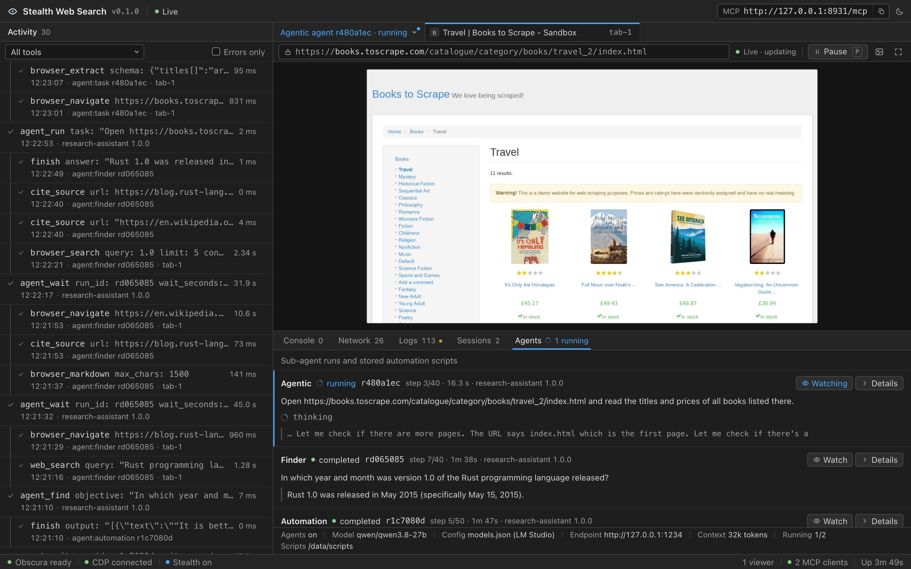
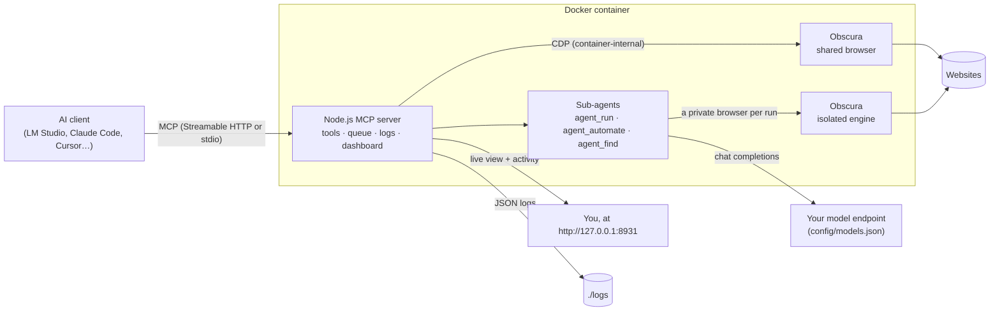
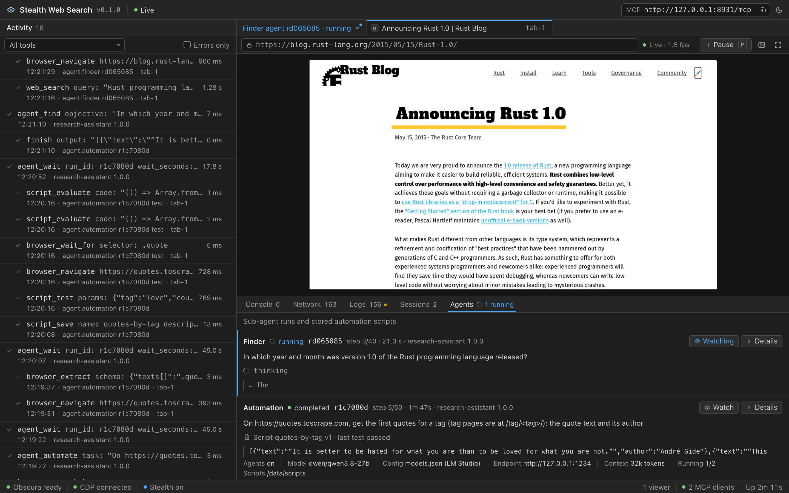
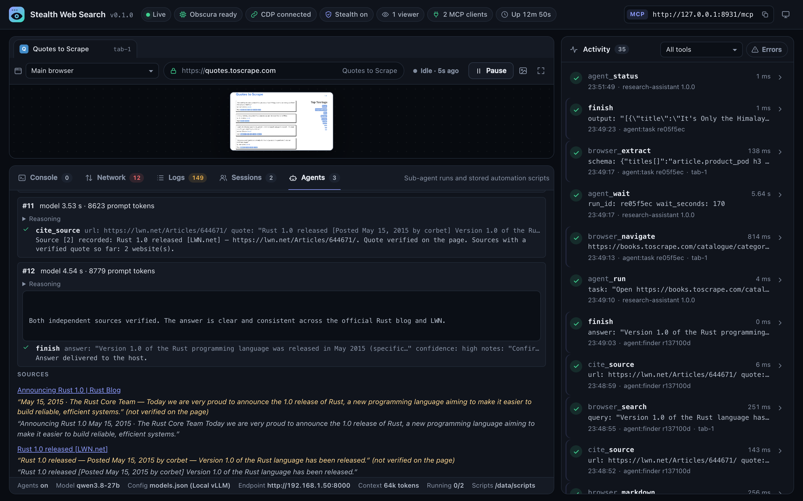
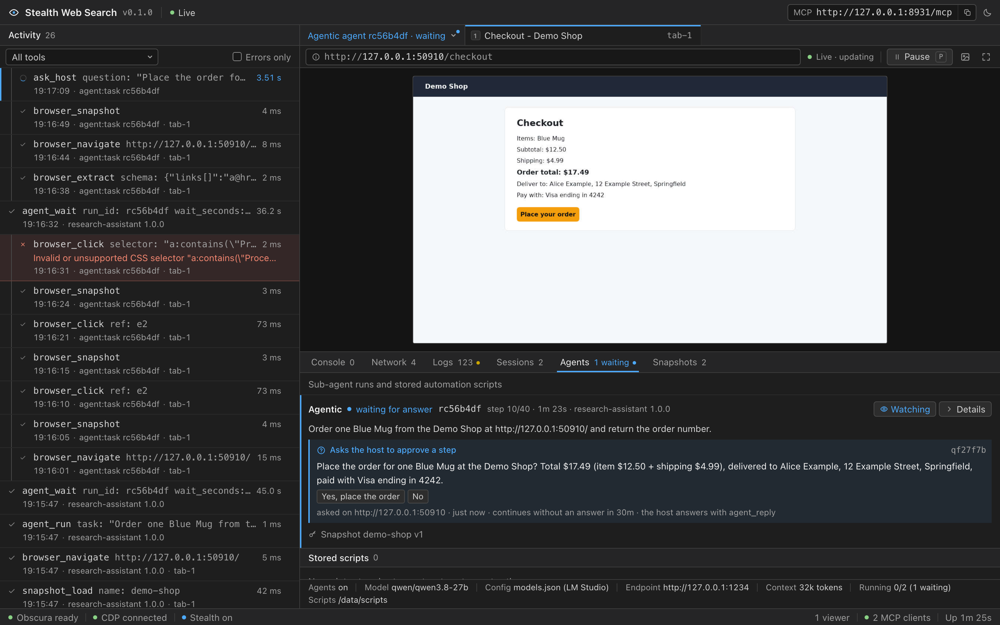
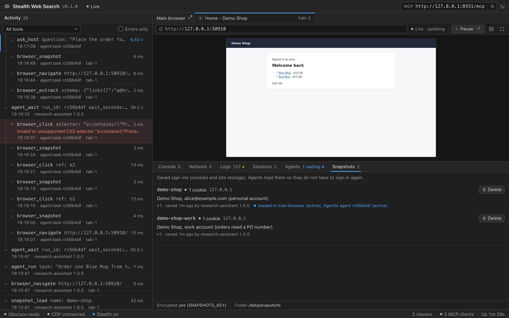

<p align="center">
  
</p>

<h1 align="center">Stealth Web Search</h1>

<p align="center">
  A stealth, JavaScript-rendering web browser and research agents for your AI, over MCP.<br>
  One Docker container. Every step logged. Watch it all live.
</p>

<p align="center">
  <a href="https://github.com/tanishmeh/stealth-web-search/actions/workflows/ci.yml"></a>
  <a href="https://tanishmeh.github.io/stealth-web-search/"></a>
  <a href="LICENSE"></a>
  
  
</p>

<p align="center">
  <a href="https://tanishmeh.github.io/stealth-web-search/"><b>Website</b></a> ·
  <a href="docs/GETTING_STARTED.md"><b>Getting started</b></a> ·
  <a href="docs/LM_STUDIO.md"><b>LM Studio</b></a> ·
  <a href="docs/CLIENTS.md"><b>MCP clients</b></a> ·
  <a href="docs/MODELS.md"><b>models.json</b></a> ·
  <a href="docs/TOOLS.md"><b>Tools</b></a>
</p>

<p align="center">
  <a href="https://lmstudio.ai/install-mcp?name=stealth-web-search&config=eyJ1cmwiOiJodHRwOi8vMTI3LjAuMC4xOjg5MzEvbWNwIiwidGltZW91dCI6MTgwMDAwfQ%3D%3D">
    <picture>
      <source media="(prefers-color-scheme: dark)" srcset="https://files.lmstudio.ai/deeplink/mcp-install-dark.svg">
      
    </picture>
  </a>
</p>



Stealth Web Search is an [MCP](https://modelcontextprotocol.io) server that gives AI agents a real web browser, and can run **sub-agents** that do whole browser jobs on their own: complete a task, turn it into a reusable script, or research a question across several sources and cite them. The browser is [Obscura](https://github.com/h4ckf0r0day/obscura), a headless browser written in Rust that runs page JavaScript in V8 and has built-in anti-fingerprinting. Everything runs in one Docker container, logs every step, and connects to local models in [LM Studio](https://lmstudio.ai) or any other MCP client.

## Features

- **A real browser for agents.** 41 `browser_*` tools cover navigation, reading pages (text, Markdown, links, structured extraction), clicking, typing, forms, keyboard, scrolling, waiting, tabs, cookies and session state, JavaScript evaluation, console and network inspection, screenshots and PDFs. See the [tool reference](docs/TOOLS.md).
- **Sub-agents.** Hand a whole job to an agent that runs inside the container with its own isolated browser and any OpenAI-compatible model (vLLM, LM Studio, Ollama, llama.cpp, OpenAI…). `agent_run` completes a TASK and returns the OUTPUT you describe; `agent_automate` also writes, verifies and stores a reusable script and tells you its parameters and how to run it; `agent_find` searches the web, cross-checks several sources and returns the answer with cited links. Stored scripts replay later with `script_run`, with no model. A run asks your agent only when it has to, for example before it places an order or for a sign-in code, and continues when your agent answers with `agent_reply`. Until then the server blocks the final order or payment button. See [Sub-agents](docs/AGENTS.md).
- **Saved sign-ins.** Sign in once, save it as a named, described snapshot (cookies and site storage for chosen sites), and load it into your browser or start a sub-agent with it, so agents do not sign in again. A successful run keeps the snapshot's sign-in fresh, snapshots can be encrypted at rest, and the dashboard lists them and deletes them on request. See [Snapshots](docs/SNAPSHOTS.md).
- **One JSON file for the model.** Point the sub-agents at your model with [`config/models.json`](docs/MODELS.md), in the same provider format editors use for custom endpoints. It is validated at startup, and one command in the container shows what the agents will use and whether the model answers.
- **JavaScript rendering.** Pages run their scripts in V8 before the agent reads them. Single-page apps and content loaded with JavaScript work.
- **Stealth by default.** Obscura's stealth build uses a consistent Chrome fingerprint, TLS fingerprint impersonation, `navigator.webdriver` reported as `false`, and tracker blocking. Element references stay on the server, so tools never write marker attributes or globals into pages.
- **Watch the agents live.** A dashboard at `http://127.0.0.1:8931/` streams the agent's tab and marks clicks and typing on the page. It shows every tool call with its arguments and result, the page console, network requests, server logs and connected MCP clients. A browser picker switches the live view to any sub-agent's private browser, and the Agents tab shows each run's steps, streaming reasoning, sources and result.
- **Logs everything.** Every MCP message, tool call (arguments, result, duration), browser (CDP) command and event, page console message and network request is written as structured JSON to rotating files and stdout. Passwords and cookie values are redacted by default. See [Logging](docs/LOGGING.md).
- **Works with LM Studio.** One-click install into LM Studio, a setup script for `mcp.json`, a command-line agent that drives local models through the browser, and end-to-end checks with a real model. LM Studio can also be the model the sub-agents use. See the [LM Studio guide](docs/LM_STUDIO.md).
- **Works with any MCP client.** Streamable HTTP at `/mcp` for both 2025 and 2026 protocol revisions, plus a stdio bridge for stdio-only clients. See [Connecting MCP clients](docs/CLIENTS.md).
- **Hardened container.** Non-root user, read-only filesystem, all Linux capabilities dropped, `no-new-privileges`, and a health check. The CDP port stays inside the container, and the MCP port is published on `127.0.0.1` only, with optional bearer-token auth and DNS-rebinding protection. `file:` and `javascript:` URLs are blocked.
- **Tested.** Unit and integration suites run against the real Obscura engine (locally or in the container), sub-agents are tested with a scripted model and live with a real one, and LM Studio end-to-end scenarios run against a real local model.

## How it works



All MCP clients share one browser. Tool calls run one at a time, in order, so an agent always sees the result of its previous action. Sub-agents and scripts each get a private browser (their own tabs and cookies) on a second engine process, so they never disturb the shared one or each other. A sub-agent's browser starts signed out, unless your agent passes it a snapshot. Details: [Architecture](docs/ARCHITECTURE.md).

## Quick start

You need [Docker Desktop](https://www.docker.com/products/docker-desktop/) (macOS, Windows) or Docker Engine with Compose 2.24 or newer (Linux), on `amd64` or `arm64`, and about 1 GB of disk space. The [getting started guide](docs/GETTING_STARTED.md) walks through every step in more detail.

```bash
git clone https://github.com/tanishmeh/stealth-web-search.git
cd stealth-web-search
docker compose up -d --build
```

The first build downloads Obscura's release binary (checksum-verified) and compiles the server. It takes about a minute. Then check that it runs:

```bash
curl -s http://127.0.0.1:8931/healthz
```

The response starts with `{"ok":true,...`. Open the dashboard at **http://127.0.0.1:8931/**. The MCP endpoint is **`http://127.0.0.1:8931/mcp`**.

On Linux, the container runs as uid 1000 and writes its logs to `./logs`. If your user id is not 1000, run `sudo chown -R 1000:1000 logs` once (otherwise the server logs to stdout only and says so). The same applies to other folders you mount, such as `./config`.

The defaults work for most setups. To change a setting, `cp .env.example .env` and edit it; the options people change most:

| Variable | Default | When to change it |
|---|---|---|
| `ALLOW_PRIVATE_NETWORK` | `false` | Set `true` to let the browser open sites on your machine or LAN (use `http://host.docker.internal:<port>` for your host) |
| `AUTH_TOKEN` | — | Set a token if anyone else can reach port 8931 |
| `TOOLSETS` | `all` | Use `core,content,forms` for small local models |
| `OBSCURA_PROXY` | — | Route browsing through an HTTP or SOCKS5 proxy |
| `HOST_PORT` | `8931` | Port 8931 is taken |
| `SNAPSHOTS_KEY` | — | Set a secret to encrypt saved sign-ins ([snapshots](docs/SNAPSHOTS.md)) at rest |

All options are in [Configuration](docs/CONFIGURATION.md). Apply changes with `docker compose up -d`.

## Connect a client

### LM Studio

With the server running, click **Add to LM Studio** above (it opens LM Studio's install dialog through lmstudio.ai), or run the setup script, which edits `~/.lmstudio/mcp.json` for you and keeps your other servers:

```bash
npm install
npm run lmstudio:setup
```

In LM Studio, load a model trained for tool use with a context length of 32k or more, open a new chat, and turn on **mcp/stealth-web-search** in the Integrations panel. Then ask something like *"Open https://quotes.toscrape.com/js/ and tell me who wrote the first three quotes"* and watch it work on the dashboard.

To add it by hand, put this entry in `mcp.json` (LM Studio: **Program → Install → Edit mcp.json**):

```json
{
  "mcpServers": {
    "stealth-web-search": {
      "url": "http://127.0.0.1:8931/mcp",
      "timeout": 180000
    }
  }
}
```

There is also a command-line agent that drives an LM Studio model through the browser with a readable transcript, no `mcp.json` needed:

```bash
npm run lmstudio:agent -- "Open https://example.com and tell me the main heading"
```

Everything about LM Studio, including using it as the sub-agents' model, is in the [LM Studio guide](docs/LM_STUDIO.md).

### Other MCP clients

| Client | Configuration |
|---|---|
| Claude Code | `claude mcp add --transport http stealth-web-search http://127.0.0.1:8931/mcp` |
| Cursor | [`examples/cursor-mcp.json`](examples/cursor-mcp.json) |
| VS Code | [`examples/vscode-mcp.json`](examples/vscode-mcp.json) |
| Claude Desktop and other stdio-only clients | [`examples/claude-desktop-config.json`](examples/claude-desktop-config.json): runs `docker exec -i stealth-web-search node dist/stdio-bridge.js` |
| Anything else | Streamable HTTP at `http://127.0.0.1:8931/mcp` |

More clients, bearer tokens and remote access: [Connecting MCP clients](docs/CLIENTS.md).

## Turn on the sub-agents

The sub-agents need an OpenAI-compatible model with tool calling. Describe it in `config/models.json`:

```bash
cp config/models.example.json config/models.json
```

The file lists providers and their models, in the format editors use for custom endpoints. The first model that supports tool calling is used, unless `AGENT_LLM_MODEL` names another. A minimal file:

```json
[
  {
    "name": "Local vLLM",
    "vendor": "customendpoint",
    "apiKey": "your-api-key",
    "apiType": "chat-completions",
    "models": [
      {
        "id": "qwen3.8-27b",
        "url": "http://192.168.1.50:8000/v1/chat/completions",
        "toolCalling": true,
        "streaming": true,
        "contextWindow": 262144,
        "supportsReasoningEffort": ["low", "medium", "xhigh"],
        "modelOptions": { "temperature": 0.4, "top_p": 0.95 }
      }
    ],
    "settings": { "qwen3.8-27b": { "reasoningEffort": "medium" } }
  }
]
```

The server reads `config/models.json` only at startup, so restart it with `docker compose restart` (`docker compose up -d` does not restart a running container when only this file changed). Then check what the agents will use:

```bash
docker compose run --rm --no-deps stealth-web-search node dist/check-config.js --ping
```

Reconnect your MCP client (in LM Studio, start a new chat). It now has `agent_run`, `agent_automate` and `agent_find`. Ask it to *"use agent_find to find out which year Python was first released"*, or call a tool directly:

```json
{ "task": "Open https://books.toscrape.com and read the first 3 books", "output": "JSON array of {title, price}", "output_format": "json" }
```

Every field of `models.json`, the `AGENT_LLM_*` environment variables that can replace or override it, and examples for LM Studio, Ollama, llama.cpp and OpenAI are in [Model configuration](docs/MODELS.md). How the agents work, their scripts and how to watch them: [Sub-agents](docs/AGENTS.md).

## The dashboard

Open **http://127.0.0.1:8931/** while an agent works.

- **Live view.** The agent's active tab updates as the page changes, and animated markers show where the agent clicks, types or scrolls. A banner shows which tool is running and how many calls are queued. Buttons: **Pause** (`P`), **Fullscreen** (`F`), and **Screenshot** (full-resolution PNG).
- **Activity.** One card per tool call with its status, duration, calling client, arguments and result. Filter by tool or show errors only.
- **Console / Network / Logs / Sessions.** Page console output and uncaught errors; network requests with status, type and size; the live server log with level, component and text filters and a download button; connected MCP clients.
- **Agents.** Sub-agent runs with their kind, status, current step and action, streaming reasoning and result. A run that waits for an answer shows its question. **Details** shows every step, the cited sources and the questions asked, and **Watch** (or the browser picker next to the address bar) switches the live view, console and network panes to that run's private browser. Stored automation scripts are listed below the runs.
- **Snapshots.** The saved sign-ins: name, description, sites, cookie counts and where each one is loaded, with a **Delete** button that asks for confirmation.

| Watching a sub-agent's browser | A finder run's steps and sources |
|---|---|
|  |  |
| **A sub-agent asks before it places an order** | **Saved sign-ins in the Snapshots tab** |
|  |  |

The screencast runs only while a dashboard is open and not paused, so the agent does not pay for it otherwise. The page reconnects by itself after a server restart. With `AUTH_TOKEN` set, open `http://127.0.0.1:8931/?token=<token>` once.

## Tools

| Group | Tools |
|---|---|
| `core` (16) | `browser_navigate`, `browser_back`, `browser_forward`, `browser_reload`, `browser_snapshot`, `browser_click`, `browser_fill`, `browser_type`, `browser_press_key`, `browser_select_option`, `browser_check`, `browser_scroll`, `browser_wait_for`, `browser_wait_for_text`, `browser_wait`, `browser_screenshot` |
| `content` (8) | `browser_interactive_elements`, `browser_markdown`, `browser_links`, `browser_search`, `browser_extract`, `browser_count`, `browser_get_attribute`, `browser_get_text` |
| `forms` (2) | `browser_detect_forms`, `browser_fill_form` |
| `tabs` (5) | `browser_tab_new`, `browser_tab_list`, `browser_tab_switch`, `browser_tab_close`, `browser_close` |
| `state` (5) | `browser_get_cookies`, `browser_set_cookie`, `browser_clear_cookies`, `browser_storage_state`, `browser_set_storage_state` |
| `debug` (3) | `browser_evaluate`, `browser_console_messages`, `browser_network_requests` |
| `capture` (2) | `browser_pdf`, `browser_set_viewport` |
| `agents` (7) | `agent_run`, `agent_automate`, `agent_find`, `agent_wait`, `agent_status`, `agent_cancel`, `agent_reply` (only when a model is configured) |
| `scripts` (4) | `script_list`, `script_get`, `script_run`, `script_delete` |
| `snapshots` (5) | `snapshot_list`, `snapshot_save`, `snapshot_describe`, `snapshot_load`, `snapshot_delete` |

That is 57 tools with a sub-agent model configured, 50 without. A typical agent loop: `browser_navigate`, then `browser_snapshot` (page text plus interactive elements with refs such as `e7`), then `browser_click {ref: "e7"}` / `browser_fill` / `browser_type`, then `browser_snapshot` again. Parameters and behaviour: [docs/TOOLS.md](docs/TOOLS.md).

## Logging

Logs go to stdout (`docker compose logs`) at `info` and to `./logs/` at `debug`. `./logs/` holds JSON lines, rotated daily or at 20 MB, 14 files kept, and `logs/current.log` points at the newest. Each entry has a `component`: `http`, `mcp`, `mcp-session`, `tool`, `browser`, `cdp`, `page-console`, `page-network`, `obscura`, `obscura-engine`, `live-view`, `dashboard`, `agent`, `agent-llm`, `script`, `snapshots`. Sub-agent entries carry `agentRunId` and `browserId`, and every sub-agent run also leaves a JSON transcript in `./logs/agent-runs/`. Long payloads are truncated and images are replaced by size plus hash, with a note saying how much was cut. Passwords, cookie values and credential headers are masked unless `LOG_REDACT_SECRETS=false`. `agent_reply`'s `answer` argument, secret answers such as one-time codes, and the cookies of saved sign-ins are masked always; answers that are not secret stay readable in the run's result.

```bash
# every tool call and its result, live
tail -F logs/current.log | jq -c 'select(.component=="tool") | {time, msg, args, durationMs, isError}'
```

More queries and the full list of what is logged: [docs/LOGGING.md](docs/LOGGING.md).

## Security

This server gives whoever can reach it a browser that runs on your machine. Treat port 8931 like a remote-control port.

- The port is published on `127.0.0.1` only (see `compose.yaml`). Do not change that to `0.0.0.0` unless you set `AUTH_TOKEN` and put a TLS reverse proxy in front.
- `AUTH_TOKEN` enables bearer-token authentication for `/mcp` and the dashboard.
- Host and Origin headers are validated (DNS-rebinding protection). Add reverse-proxy hostnames to `ALLOWED_HOSTS`.
- The browser cannot open `file:` or `javascript:` URLs, and by default cannot reach private networks (`ALLOW_PRIVATE_NETWORK`).
- Obscura's CDP port is bound to the container's loopback interface and never published. Running the server directly instead of in Docker (`npm run dev`) exposes an **unauthenticated** Obscura CDP socket on `127.0.0.1` for as long as the server runs — anything with access to your loopback interface can drive that browser. The port is random unless you set `OBSCURA_CDP_PORT`. The Docker image keeps this socket inside the container; prefer Docker on shared or multi-user machines.
- The container runs as a non-root user on a read-only filesystem, with all capabilities dropped and `no-new-privileges`.
- Sub-agent and script browsers run on a second Obscura engine process (`OBSCURA_SEPARATE_ENGINE`, on by default): a page that crashes the engine there cannot reset your browser, and with `OBSCURA_STORAGE_DIR` (persisted cookies) untrusted pages they visit never see your persisted logins.
- Snapshots are live sign-ins. They are stored owner-only on the `snapshots` volume, encrypted when you set `SNAPSHOTS_KEY`, and never logged. A sub-agent gets one only when your agent passes it to `agent_run`, and it and the pages it opens can then act as that account. The dashboard's delete request is protected against other websites (custom header and `Origin` check). See [Snapshots](docs/SNAPSHOTS.md#security-notes).
- `config/models.json` can hold API keys. It is gitignored and kept out of the Docker build context; it reaches the container only through the read-only `./config` mount.
- Pages visited by the agent are untrusted input. An agent can be manipulated by text on a page (prompt injection), so keep a human in the loop for sensitive accounts. Sub-agents are told to treat pages as data, work in private browsers that start without cookies unless your agent passes a snapshot, and use the same URL and private-network guards. They ask your agent before orders, payments and other steps that cannot be undone, and your agent should relay those questions to you. In `agent_run` jobs the server also refuses the final order or payment button until your agent has answered, unless it passed `confirm_purchases: false` for a purchase you approved. That check goes by the button's label and does not cover page scripts, so it backs up the question rather than replacing it.
- Automation scripts run in a QuickJS WebAssembly sandbox with no Node.js APIs (no file system, network or processes) and with memory, time and call limits. Their only access to the outside is the guarded browser.
- Obscura v0.2.2 does not enforce Chromium's cross-site request protections: it sends `SameSite=Strict`/`Lax` cookies on cross-site requests and treats `application/json` POSTs as simple requests (no CORS preflight). A page the agent visits can therefore make cross-site requests carrying any cookies you gave the browser (`browser_set_cookie`, `browser_set_storage_state`, a loaded snapshot, or cookies persisted with `OBSCURA_STORAGE_DIR`). Treat visited pages as untrusted and avoid persisting sensitive logins. See [Configuration](docs/CONFIGURATION.md).

To report a vulnerability, see [SECURITY.md](SECURITY.md).

## Documentation

| Guide | What it covers |
|---|---|
| [Getting started](docs/GETTING_STARTED.md) | Install, check, connect a client, first tasks, sub-agents, update and uninstall |
| [Connecting MCP clients](docs/CLIENTS.md) | Every client's configuration, the stdio bridge, tokens and remote access |
| [LM Studio](docs/LM_STUDIO.md) | LM Studio chats with the tools, the command-line agent, LM Studio as the sub-agents' model, end-to-end checks |
| [Configuration](docs/CONFIGURATION.md) | Every environment variable |
| [Model configuration](docs/MODELS.md) | `config/models.json`: format, model choice, overrides, examples |
| [Sub-agents](docs/AGENTS.md) | `agent_run`, `agent_automate`, `agent_find`, questions and `agent_reply`, scripts and their API |
| [Snapshots](docs/SNAPSHOTS.md) | Saved sign-ins: saving, loading, sub-agents, encryption, the dashboard tab |
| [Tool reference](docs/TOOLS.md) | Every tool's parameters and behaviour (generated from the code) |
| [Logging](docs/LOGGING.md) | What is logged, where, and how to query it |
| [Troubleshooting](docs/TROUBLESHOOTING.md) | Common problems and fixes |
| [Architecture](docs/ARCHITECTURE.md) | How the server, the engines and the sub-agents fit together |

The same guides are on the [website](https://tanishmeh.github.io/stealth-web-search/).

## Development

Run the server without Docker (Node.js 24+):

```bash
npm install
npm run obscura:download     # fetches the Obscura binary for your OS into .obscura/ (sha256-verified)
npm run dev                  # runs src/main.ts with auto-reload on http://127.0.0.1:8931
```

Tests:

```bash
npm run typecheck
npm test                     # unit tests
npm run test:integration     # starts real servers + Obscura against a local fixture website

# the same integration suite against the Docker container
docker compose -f compose.yaml -f compose.test.yaml up -d --build
npm run test:docker
docker compose up -d --build   # afterwards: back to the normal settings (private network blocked)
# with HOST_PORT or AUTH_TOKEN in .env: MCP_URL=http://127.0.0.1:<port>/mcp AUTH_TOKEN=<token> npm run test:docker

# end-to-end with a real local model in LM Studio
npm run lmstudio:e2e -- --online

# sub-agents live, with the model configured on the running server
npm run agents:e2e
```

Other scripts: `npm run build` (compile to `dist/`), `npm run config:check` (validate the configuration), `npm run docs:tools` (regenerate `docs/TOOLS.md`), `npm run site:build` / `npm run site:serve` (the website, from `site/` and the docs), `npm run lmstudio:agent -- "<task>"`.

Project layout:

```text
src/
  main.ts              startup, shutdown
  config.ts            environment configuration
  models-config.ts     config/models.json
  check-config.ts      the config:check command
  logger.ts            structured logging (stdout, rotating file, dashboard)
  obscura/process.ts   starts and supervises Obscura
  cdp/client.ts        Chrome DevTools Protocol client
  browser/             browsers (shared + isolated), tabs, page scripts, live view
  mcp/                 HTTP server, MCP transports, sessions, tool runner
  tools/               the browser_*, agent_*, script_* and snapshot_* tools
  agents/              sub-agents: model client, agent loop, the three agent kinds, web search
  scripts/             automation scripts: store, QuickJS sandbox, browser API
  snapshots/           saved sign-ins: encrypted file store, capture and load
  util/                shared helpers: log summaries, secret masking, limits
  dashboard/           dashboard API and static UI
  stdio-bridge.ts      stdio <-> HTTP bridge
config/                models.example.json (copy to models.json)
scripts/               Obscura download, LM Studio setup/agent/e2e, sub-agent e2e, docs and site generators
site/                  the website's landing page and assets
test/                  unit and integration tests, fixture website
docs/                  the guides listed above
```

Contributions are welcome: see [CONTRIBUTING.md](CONTRIBUTING.md).

## Known limitations

These come from the Obscura engine (v0.2.2) and are handled or reported by the tools where possible:

- Obscura is an independent engine, not Chromium. Some complex sites or newer Web APIs may not work.
- Hover does not trigger anything (no `mouseover`), so hover-only menus do not open. Drag and drop and file uploads are not supported.
- Screenshots do not show typed input values or checkbox states (the values are set), and CJK, Thai and Devanagari text renders as boxes in screenshots. Text extraction is unaffected.
- In stealth mode, `fetch`/XHR calls made by page scripts do not appear in `browser_network_requests`. Documents, scripts, stylesheets and images do.
- `localStorage` and `sessionStorage` do not survive a navigation or reload. Cookies do, and persist across restarts with `OBSCURA_STORAGE_DIR`. A loaded snapshot writes its saved site storage again on every page load.
- URL-fragment navigation is ignored: clicking an `<a href="#…">` link or setting `location.hash` does not fire `hashchange` or change a hash-based SPA route. Use the app's real navigation, or `browser_evaluate` to call `history.pushState` and dispatch a `hashchange`/`popstate` event.
- Inline elements that follow a block-level sibling can be laid out with a 0×0 box, so a few genuinely visible elements may be skipped by visibility checks and not captured in screenshots. Text extraction still sees them.
- Background tabs can lose their in-page JavaScript state when you switch tabs.
- Pages nested more than about 250 elements deep can crash the engine. The server restarts it automatically and tells the agent its tabs were reset.

## Troubleshooting

See [docs/TROUBLESHOOTING.md](docs/TROUBLESHOOTING.md) and, for LM Studio, [the LM Studio troubleshooting section](docs/LM_STUDIO.md#10-troubleshooting). Quick checks:

```bash
curl -s http://127.0.0.1:8931/healthz | jq
docker compose logs --tail 100
jq -c 'select(.level>=40)' logs/current.log
```

## License

[Apache License 2.0](LICENSE). Obscura is a separate project under the Apache License 2.0; the Docker image bundles an unmodified Obscura release. See [NOTICE](NOTICE).
