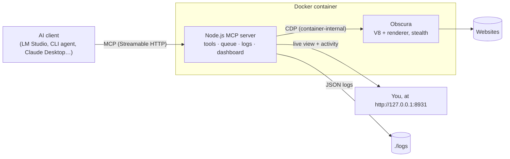

# Stealth Browser MCP

An [MCP](https://modelcontextprotocol.io) server that gives AI agents a real, JavaScript-rendering, stealthy web browser. It is packaged in one Docker container, logs everything, and has a live dashboard where you can watch what the agent is doing.

The browser is [Obscura](https://github.com/h4ckf0r0day/obscura), a headless browser written in Rust. It runs page JavaScript in V8, renders pages, and has built-in anti-fingerprinting. This project wraps it in a production-quality MCP server and connects it to local models in [LM Studio](https://lmstudio.ai).


## Features

- **Real browser for agents.** 41 `browser_*` tools cover navigation, reading pages (text, Markdown, links, structured extraction), clicking, typing, forms, keyboard, scrolling, waiting, tabs, cookies and session state, JavaScript evaluation, console and network inspection, screenshots and PDFs. See the [tool reference](docs/TOOLS.md).
- **JavaScript rendering.** Pages run their scripts in V8 before the agent reads them. Single-page apps and content loaded with JavaScript work.
- **Stealth by default.** Obscura's stealth build uses a consistent Chrome fingerprint, TLS fingerprint impersonation, `navigator.webdriver` reported as `false`, and tracker blocking. Element references stay on the server, so tools never write marker attributes or globals into pages.
- **Watch the agent live.** A dashboard at `http://127.0.0.1:8931/` streams the agent's tab and marks clicks and typing on the page. It also shows every tool call with its arguments and result, plus the page console, network requests, server logs and connected MCP clients.
- **Logs everything.** Every MCP message, tool call (arguments, result, duration), browser (CDP) command and event, page console message and network request is written as structured JSON to rotating files and stdout. Passwords and cookie values are redacted by default. See [Logging](docs/LOGGING.md).
- **Works with LM Studio.** A one-command `mcp.json` setup for LM Studio chats, a command-line agent that drives local models through the browser, and end-to-end checks with a real model. See the [LM Studio guide](docs/LM_STUDIO.md).
- **Works with any MCP client.** Streamable HTTP at `/mcp` for both 2025 and 2026 protocol revisions, plus a stdio bridge for stdio-only clients (Claude Desktop, Cursor, VS Code and others; see [`examples/`](examples)).
- **Hardened container.** Non-root user, read-only filesystem, all Linux capabilities dropped, `no-new-privileges`, and a health check. The CDP port stays inside the container, and the MCP port is published on `127.0.0.1` only, with optional bearer-token auth and DNS-rebinding protection. `file:` and `javascript:` URLs are blocked.
- **Tested.** Unit and integration suites run against the real Obscura engine (locally or in the container), and LM Studio end-to-end scenarios run against a real local model.

## How it works



All MCP clients share one browser. Tool calls run one at a time, in order, so an agent always sees the result of its previous action. Details: [Architecture](docs/ARCHITECTURE.md).

## Quick start

### Requirements

- [Docker Desktop](https://www.docker.com/products/docker-desktop/) (macOS or Windows), or Docker Engine with the Compose plugin (Linux), on `amd64` or `arm64`
- About 1 GB of disk space for the image
- Optional, for LM Studio and the helper scripts: [Node.js 24+](https://nodejs.org) and [LM Studio](https://lmstudio.ai)

### 1. Get the code

```bash
git clone https://github.com/<you>/stealth-browser-mcp.git
cd stealth-browser-mcp
```

### 2. (Optional) configure

```bash
cp .env.example .env
```

The defaults work for most setups. The settings you are most likely to change:

| Variable | Default | When to change it |
|---|---|---|
| `ALLOW_PRIVATE_NETWORK` | `false` | Set `true` to let the browser open sites on your machine or LAN (use `http://host.docker.internal:<port>` for your host) |
| `AUTH_TOKEN` | — | Set a token if anyone else can reach port 8931 |
| `TOOLSETS` | `all` | Use `core,content,forms` for small local models |
| `OBSCURA_PROXY` | — | Route browsing through an HTTP or SOCKS5 proxy |
| `HOST_PORT` | `8931` | Port 8931 is taken |

All options are in [Configuration](docs/CONFIGURATION.md).

### 3. Build and start

```bash
docker compose up -d --build
```

The first build downloads Obscura's release binary (checksum-verified) and compiles the server. It takes about a minute.

### 4. Check that it is running

```bash
curl -s http://127.0.0.1:8931/healthz
```

The response starts with `{"ok":true,...`. Now open the dashboard at **http://127.0.0.1:8931/**.

### 5. Connect a client

The MCP endpoint is **`http://127.0.0.1:8931/mcp`** (Streamable HTTP).

**LM Studio** (needs Node.js for the setup script):

```bash
npm install
npm run lmstudio:setup
```

In LM Studio, load a model trained for tool use with a context length of 32k or more, open a new chat, and turn on **mcp/stealth-browser** in the Integrations panel. Then ask something like *"Open https://quotes.toscrape.com/js/ and tell me who wrote the first three quotes."* and watch it work on the dashboard. The full walkthrough, including a manual `mcp.json` snippet, is in [docs/LM_STUDIO.md](docs/LM_STUDIO.md).

**Other clients**

| Client | Configuration |
|---|---|
| Claude Code | `claude mcp add --transport http stealth-browser http://127.0.0.1:8931/mcp` |
| Cursor | [`examples/cursor-mcp.json`](examples/cursor-mcp.json) |
| VS Code | [`examples/vscode-mcp.json`](examples/vscode-mcp.json) |
| Claude Desktop and other stdio-only clients | [`examples/claude-desktop-config.json`](examples/claude-desktop-config.json): runs `docker exec -i stealth-browser-mcp node dist/stdio-bridge.js` |

### 6. Try it without writing any client code

With LM Studio's local server running (**Developer → Start Server**) and a tool-capable model loaded:

```bash
npm run lmstudio:agent -- "Open https://example.com and tell me the main heading"
```

The agent prints each step (the model's reasoning, the tool it calls and the result) while the dashboard shows the browser.

### Stop, update, logs

```bash
docker compose logs -f              # server output (JSON)
tail -F logs/current.log | jq -c .  # the detailed log file on your machine
docker compose down                 # stop
git pull && docker compose up -d --build   # update
```

## The dashboard

Open **http://127.0.0.1:8931/** while an agent works.

- **Live view.** The agent's active tab updates as the page changes, and animated markers show where the agent clicks, types or scrolls. A banner shows which tool is running and how many calls are queued. Buttons: **Pause** (`P`), **Fullscreen** (`F`), and **Screenshot** (full-resolution PNG).
- **Activity.** One card per tool call with its status, duration, calling client, arguments and result. Filter by tool or show errors only.
- **Console / Network / Logs / Sessions.** Page console output and uncaught errors; network requests with status, type and size; the live server log with level, component and text filters and a download button; connected MCP clients.

The screencast runs only while a dashboard is open and not paused, so the agent does not pay for it otherwise. The page reconnects by itself after a server restart. With `AUTH_TOKEN` set, open `http://127.0.0.1:8931/?token=<token>` once.

## Tools

| Group | Tools |
|---|---|
| `core` (16) | `browser_navigate`, `browser_back`, `browser_forward`, `browser_reload`, `browser_snapshot`, `browser_click`, `browser_fill`, `browser_type`, `browser_press_key`, `browser_select_option`, `browser_check`, `browser_scroll`, `browser_wait_for`, `browser_wait_for_text`, `browser_wait`, `browser_screenshot` |
| `content` (8) | `browser_interactive_elements`, `browser_markdown`, `browser_links`, `browser_search`, `browser_extract`, `browser_count`, `browser_get_attribute`, `browser_get_text` |
| `forms` (2) | `browser_detect_forms`, `browser_fill_form` |
| `tabs` (5) | `browser_tab_new`, `browser_tab_list`, `browser_tab_switch`, `browser_tab_close`, `browser_close` |
| `state` (5) | `browser_get_cookies`, `browser_set_cookie`, `browser_clear_cookies`, `browser_storage_state`, `browser_set_storage_state` |
| `debug` (3) | `browser_evaluate`, `browser_console_messages`, `browser_network_requests` |
| `capture` (2) | `browser_pdf`, `browser_set_viewport` |

A typical agent loop: `browser_navigate`, then `browser_snapshot` (page text plus interactive elements with refs such as `e7`), then `browser_click {ref: "e7"}` / `browser_fill` / `browser_type`, then `browser_snapshot` again. Parameters and behaviour: [docs/TOOLS.md](docs/TOOLS.md).

## Logging

Logs go to stdout (`docker compose logs`) at `info` and to `./logs/` at `debug`. `./logs/` holds JSON lines, rotated daily or at 20 MB, 14 files kept, and `logs/current.log` points at the newest. Each entry has a `component`: `http`, `mcp`, `mcp-session`, `tool`, `browser`, `cdp`, `page-console`, `page-network`, `obscura`, `obscura-engine`, `live-view`, `dashboard`. Long payloads are truncated and images are replaced by size plus hash, with a note saying how much was cut. Passwords, cookie values and credential headers are masked unless `LOG_REDACT_SECRETS=false`.

```bash
# every tool call and its result, live
tail -F logs/current.log | jq -c 'select(.component=="tool") | {time, msg, args, durationMs, isError}'
```

More queries and the full list of what is logged: [docs/LOGGING.md](docs/LOGGING.md).

## Security

This server gives whoever can reach it a browser that runs on your machine. Treat port 8931 like a remote-control port.

- The port is published on `127.0.0.1` only (see `compose.yaml`). Do not change that to `0.0.0.0` unless you set `AUTH_TOKEN` and put a TLS reverse proxy in front.
- `AUTH_TOKEN` enables bearer-token authentication for `/mcp` and the dashboard.
- Host and Origin headers are validated (DNS-rebinding protection). Add reverse-proxy hostnames to `ALLOWED_HOSTS`.
- The browser cannot open `file:` or `javascript:` URLs, and by default cannot reach private networks (`ALLOW_PRIVATE_NETWORK`).
- Obscura's CDP port is bound to the container's loopback interface and never published. Running the server directly instead of in Docker (`npm run dev`) exposes an **unauthenticated** Obscura CDP socket on `127.0.0.1` for as long as the server runs — anything with access to your loopback interface can drive that browser. The port is random unless you set `OBSCURA_CDP_PORT`. The Docker image keeps this socket inside the container; prefer Docker on shared or multi-user machines.
- The container runs as a non-root user on a read-only filesystem, with all capabilities dropped and `no-new-privileges`.
- Pages visited by the agent are untrusted input. An agent can be manipulated by text on a page (prompt injection), so keep a human in the loop for sensitive accounts.
- Obscura v0.2.2 does not enforce Chromium's cross-site request protections: it sends `SameSite=Strict`/`Lax` cookies on cross-site requests and treats `application/json` POSTs as simple requests (no CORS preflight). A page the agent visits can therefore make cross-site requests carrying any cookies you gave the browser (`browser_set_cookie`, `browser_set_storage_state`, or cookies persisted with `OBSCURA_STORAGE_DIR`). Treat visited pages as untrusted and avoid persisting sensitive logins. See [Configuration](docs/CONFIGURATION.md).

## Development

Run the server without Docker (Node.js 24+):

```bash
npm install
npm run obscura:download     # fetches the Obscura binary for your OS into .obscura/ (sha256-verified)
npm run dev                  # runs src/main.ts with auto-reload on http://127.0.0.1:8931
```

Tests:

```bash
npm run typecheck
npm test                     # unit tests
npm run test:integration     # starts real servers + Obscura against a local fixture website

# the same integration suite against the Docker container
docker compose -f compose.yaml -f compose.test.yaml up -d --build
npm run test:docker

# end-to-end with a real local model in LM Studio
npm run lmstudio:e2e -- --online
```

Other scripts: `npm run build` (compile to `dist/`), `npm run docs:tools` (regenerate `docs/TOOLS.md`), `npm run lmstudio:agent -- "<task>"`.

Project layout:

```
src/
  main.ts              startup, shutdown
  config.ts            environment configuration
  logger.ts            structured logging (stdout, rotating file, dashboard)
  obscura/process.ts   starts and supervises Obscura
  cdp/client.ts        Chrome DevTools Protocol client
  browser/             shared browser, tabs, page scripts, live view
  mcp/                 HTTP server, MCP transports, sessions, tool runner
  tools/               the browser_* tools
  dashboard/           dashboard API and static UI
  stdio-bridge.ts      stdio <-> HTTP bridge
scripts/               Obscura download, LM Studio setup/agent/e2e, docs generator
test/                  unit and integration tests, fixture website
docs/                  architecture, configuration, logging, tools, LM Studio, troubleshooting
```

## Known limitations

These come from the Obscura engine (v0.2.2) and are handled or reported by the tools where possible:

- Obscura is an independent engine, not Chromium. Some complex sites or newer Web APIs may not work.
- Hover does not trigger anything (no `mouseover`), so hover-only menus do not open. Drag and drop and file uploads are not supported.
- Screenshots do not show typed input values or checkbox states (the values are set), and CJK, Thai and Devanagari text renders as boxes in screenshots. Text extraction is unaffected.
- In stealth mode, `fetch`/XHR calls made by page scripts do not appear in `browser_network_requests`. Documents, scripts, stylesheets and images do.
- `localStorage` and `sessionStorage` do not survive a navigation or reload. Cookies do, and persist across restarts with `OBSCURA_STORAGE_DIR`.
- URL-fragment navigation is ignored: clicking an `<a href="#…">` link or setting `location.hash` does not fire `hashchange` or change a hash-based SPA route. Use the app's real navigation, or `browser_evaluate` to call `history.pushState` and dispatch a `hashchange`/`popstate` event.
- Inline elements that follow a block-level sibling can be laid out with a 0×0 box, so a few genuinely visible elements may be skipped by visibility checks and not captured in screenshots. Text extraction still sees them.
- Background tabs can lose their in-page JavaScript state when you switch tabs.
- Pages nested more than about 250 elements deep can crash the engine. The server restarts it automatically and tells the agent its tabs were reset.

## Troubleshooting

See [docs/TROUBLESHOOTING.md](docs/TROUBLESHOOTING.md) and, for LM Studio, [docs/LM_STUDIO.md#10-troubleshooting](docs/LM_STUDIO.md#10-troubleshooting). Quick checks:

```bash
curl -s http://127.0.0.1:8931/healthz | jq
docker compose logs --tail 100
jq -c 'select(.level>=40)' logs/current.log
```

## License

[Apache License 2.0](LICENSE). Obscura is a separate project under the Apache License 2.0. See [NOTICE](NOTICE).
