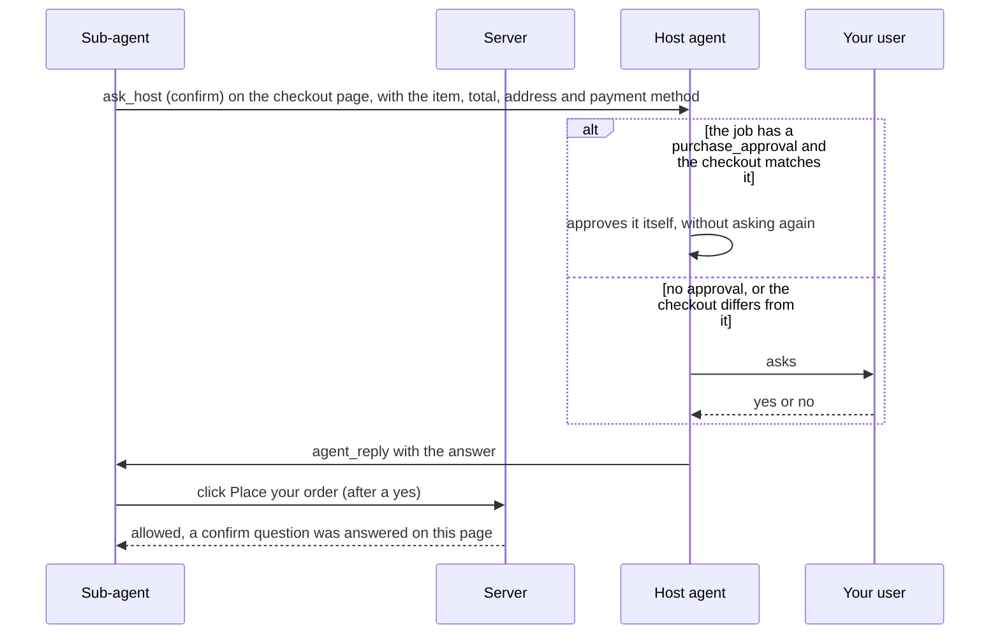

# Sub-agents

Besides the `browser_*` tools, which let your agent (the **host agent**) drive the browser step by step, the server can run **sub-agents**: the host hands over a whole job and gets back only the result. Sub-agents run inside the server (inside the Docker container, next to Obscura) and talk to any **OpenAI-compatible chat completions endpoint**: vLLM, LM Studio, llama.cpp, Ollama, OpenAI and others.

| Tool | Agent | The host gives | The host gets back |
|---|---|---|---|
| [`agent_run`](TOOLS.md#agent_run) | Agentic | TASK (what to do) and OUTPUT (what to send back) | The OUTPUT |
| [`agent_automate`](TOOLS.md#agent_automate) | Automation | TASK and OUTPUT | A stored, verified script: its name, parameters, how to run it, the verification result, plus the task's OUTPUT |
| [`agent_find`](TOOLS.md#agent_find) | Finder | OBJECTIVE (what to find), optionally OUTPUT | The answer, confidence, conflicts between sources, and the cited links with supporting quotes |

The regular `browser_*` tools stay available: the host can keep driving its own browser while sub-agents work.

Sub-agents work on their own, but a run can pause and ask the host a question when it cannot continue correctly without one, for example before it places an order: see [Questions from sub-agents](#questions-from-sub-agents). An `agent_run` or `agent_automate` agent never places an order or pays before the host has answered such a question: the server blocks the final button ([Orders and payments](#orders-and-payments)). `agent_run` can also start signed in to a site with a saved sign-in: see [Snapshots](SNAPSHOTS.md).

## How it works

```text
host agent ──MCP──▶ agent_run / agent_automate / agent_find
     ▲    │                │
     │    │                ▼
     │    └─agent_reply─▶ sub-agent (in the server)  ◀──chat completions──▶  your model endpoint
     └──── question ◀──────┤ (ask_host, only when it needs the host)
                           │ tool calls (browser_*, web_search, note, finish, …)
                           ▼
                 its own isolated browser (a separate Obscura CDP connection: own tabs, cookies, storage;
                 empty, or signed in from a snapshot the host named)
```

- **Isolated browser per run.** Obscura keeps pages and cookies per CDP connection, so every run gets a private browser that starts empty and is discarded afterwards. The only exception is a snapshot the host passes to `agent_run`: the browser then starts with that saved sign-in ([Snapshots](SNAPSHOTS.md)). The host's browser and other runs are never touched, and runs can work at the same time (`AGENT_MAX_CONCURRENT`, default 2; more wait in a queue). Sub-agent and script browsers also run on a second Obscura engine process (`OBSCURA_SEPARATE_ENGINE`, on by default), so a page that crashes the engine during a run (Obscura v0.2.2 has such bugs) cannot reset the host's browser; the run itself reconnects and is told its pages were reset. That engine never persists cookies, even with `OBSCURA_STORAGE_DIR`.
- **Same tools, same guards.** Sub-agents use the regular browser tools through the same code path as MCP clients, so URL scheme rules, the SSRF guard (`ALLOW_PRIVATE_NETWORK`), timeouts and secret redaction all apply. Sub-agents cannot start sub-agents.
- **Everything is logged and visible.** Each model request and response, and every tool call, is logged with the run id. The dashboard lists runs in the **Agents** tab (live step, current action, the model's reasoning as it streams, the result), and its browser picker switches the live view to any sub-agent's browser. A JSON transcript of every run is written to `logs/agent-runs/`.
- **Context budget.** Each run keeps its transcript within `AGENT_CONTEXT_TOKENS` (64k by default). Tool results are capped, older results are shortened first, and if needed the oldest steps are dropped. Facts the agent saved with `note` are kept. The characters-per-token ratio is calibrated from the token counts the endpoint reports.
- **Budgets.** `max_steps` (per call, default `AGENT_MAX_STEPS`=40, 50 for automation) and `AGENT_MAX_RUNTIME_MS` (15 min). When a budget runs out, the agent is made to call `finish` with what it has, and the result says so (`forced: true`). If even that last turn does not finish in time, the result contains the notes the agent saved (and, for the finder, the sources it had cited).

## Setup

The sub-agents need an OpenAI-compatible chat completions model. Describe it in `config/models.json` (recommended), or with `AGENT_LLM_*` variables in `.env`.

### With `config/models.json`

Copy the example, edit it, and start or restart the server:

```bash
cp config/models.example.json config/models.json
docker compose up -d --build     # first start
docker compose restart           # after editing config/models.json
```

```json
[
  {
    "name": "Local vLLM",
    "vendor": "customendpoint",
    "apiKey": "your-api-key",
    "apiType": "chat-completions",
    "models": [
      {
        "id": "qwen3.8-27b",
        "name": "Qwen3.8 27B (vLLM)",
        "url": "http://192.168.1.50:8000/v1/chat/completions",
        "toolCalling": true,
        "streaming": true,
        "contextWindow": 262144,
        "maxOutputTokens": 32768,
        "supportsReasoningEffort": ["low", "medium", "xhigh"],
        "reasoningEffortFormat": "chat-completions",
        "modelOptions": { "temperature": 0.4, "top_p": 0.95 }
      }
    ],
    "settings": { "qwen3.8-27b": { "reasoningEffort": "medium" } }
  }
]
```

This is the provider format editors use for "custom endpoint" models, so you can paste an existing list. The file can list several providers and models: the first model with tool calling is used, or the one `AGENT_LLM_MODEL` names. `contextWindow` and `maxOutputTokens` cap the agent's budget (`AGENT_CONTEXT_TOKENS`, `AGENT_MAX_OUTPUT_TOKENS`), and `modelOptions` holds sampling and extra request fields. Every field, the rules, and examples for vLLM, LM Studio, Ollama, llama.cpp and OpenAI are in [MODELS.md](MODELS.md).

Check it, including whether the endpoint answers:

```bash
docker compose run --rm --no-deps stealth-web-search node dist/check-config.js --ping
```

### With environment variables

Without a models file, set the endpoint in `.env` next to `compose.yaml` and run `docker compose up -d`:

```ini
AGENT_LLM_URL=http://192.168.1.50:8000/v1/chat/completions   # base URL (…/v1) or the full endpoint
AGENT_LLM_API_KEY=your-api-key
AGENT_LLM_MODEL=qwen3.8-27b                                   # default: the first model the endpoint lists
AGENT_LLM_TEMPERATURE=0.4
AGENT_LLM_TOP_P=0.95
AGENT_LLM_REASONING_EFFORT=medium                             # sent as reasoning_effort; "none" leaves it out
AGENT_CONTEXT_TOKENS=65536
AGENT_MAX_OUTPUT_TOKENS=8192
```

With a models file, the URL, key, sampling, reasoning effort and streaming variables override the matching fields of the file when they are set, `AGENT_LLM_MODEL` selects a model in the file, and the file's `contextWindow` and `maxOutputTokens` cap the two budget variables ([details](MODELS.md#environment-overrides)). `AGENT_MODELS_FILE=none` ignores the file. All settings are listed in [CONFIGURATION.md](CONFIGURATION.md#sub-agents).

### What the server checks

At startup the server logs where the model comes from (the `agents` field of the `starting` line: the file and provider, or `AGENT_LLM_* environment variables`). It then asks the endpoint for its models and logs either `agent model endpoint reachable` (with the models it lists) or a warning. The **Agents** tab of the dashboard shows the same in its footer (`Config models.json (Local vLLM)`).

The `agent_*` tools are only offered when a models file or `AGENT_LLM_URL` configures a model. The `script_*` tools are always available. Both follow `TOOLSETS` like every other group (the default `all` includes them; with a custom list, add `agents,scripts`).

The **model** must support tool calling (OpenAI `tools` / `tool_calls`); vLLM needs `--enable-auto-tool-choice` and a tool-call parser for the model. Reasoning models work: streamed `reasoning` / `reasoning_content` is shown on the dashboard and kept in transcripts, but never sent back to the model. Other request fields (`top_k`, `repetition_penalty`, …) go in `modelOptions` in the models file, or in `AGENT_LLM_EXTRA_BODY` as JSON. For Qwen-style chat templates, `AGENT_LLM_THINKING=false` turns thinking off.

### Where is the model?

The endpoint is reached from inside the container:

| Model server | `url` in `config/models.json`, or `AGENT_LLM_URL` |
|---|---|
| Another machine on your network | `http://<its-ip>:<port>/v1` |
| Your own machine (LM Studio, Ollama, vLLM…) | `http://host.docker.internal:<port>/v1` (LM Studio: `http://host.docker.internal:1234/v1`) |
| A hosted API | `https://api.example.com/v1` plus the key (`apiKey`, or `AGENT_LLM_API_KEY`) |

On Linux, `host.docker.internal` reaches your machine only on addresses the model server listens on beyond loopback: LM Studio **Serve on Local Network**, `OLLAMA_HOST=0.0.0.0`, vLLM `--host 0.0.0.0`. Docker Desktop (macOS, Windows) also reaches servers on 127.0.0.1.

**OpenAI and other hosted APIs** are stricter about request fields. For OpenAI non-reasoning models (gpt-4o, gpt-4.1), leave `reasoning_effort` out: `"reasoningEffortFormat": "none"` in the models file, or `AGENT_LLM_REASONING_EFFORT=none`. For reasoning models (o-series, gpt-5), set `AGENT_LLM_MAX_TOKENS_FIELD=max_completion_tokens` in `.env`, and leave the sampling fields out: `"temperature": null` and `"top_p": null` in `modelOptions`, or `AGENT_LLM_TEMPERATURE=none` and `AGENT_LLM_TOP_P=none` (they only accept the defaults). Without a models file, also set `AGENT_LLM_MODEL`. See the [OpenAI example](MODELS.md#openai).

## Waiting for results

Runs usually take from 10 seconds to a few minutes. `agent_run`, `agent_automate` and `agent_find` wait up to `wait_seconds` (default `AGENT_WAIT_SECONDS`=170, which fits under LM Studio's 180 s tool timeout that `npm run lmstudio:setup` configures). If the run is not done by then, the tool returns right away with:

```text
Agent run r3f9a1c2 (finder) is still running: step 6 of 40, 1 min 50 s so far; now: browser_navigate https://…
Call agent_wait with {"run_id": "r3f9a1c2"} to wait for the result (agent_status to check progress, agent_cancel to stop it).
```

The run keeps going; the host collects the result with `agent_wait`. While a tool waits, the server sends MCP **progress notifications** (`step 6: browser_navigate …`) if the client asked for them, so clients that reset their timeout on progress wait patiently. `agent_status` without a `run_id` lists recent runs. When the run pauses with a question, the tools return at once instead (see the next section).

Results come as readable text plus `structuredContent` (JSON) with the same data: `run_id`, `status`, `success`, `steps`, `duration_ms`, the kind-specific fields below, and `transcript` (path of the JSON transcript in the container). A run's `status` is one of:

| Status | Meaning |
|---|---|
| `queued` | Waiting for a free slot (`AGENT_MAX_CONCURRENT`) |
| `running` | Working |
| `waiting` | Paused on a question for the host: answer it with `agent_reply` |
| `completed`, `failed`, `cancelled` | Done |

## Questions from sub-agents

Some steps need a decision that only you or your user can make. An `agent_run` or `agent_automate` agent can then pause and ask the host one question with its `ask_host` tool. Each question pauses the job, so it is told to ask only when it cannot continue correctly without the answer, and to give a reason:

| Reason | When the agent asks |
|---|---|
| `confirm` | Before it places an order, pays or sends money, always, with the item, the total price, the delivery address and the payment method, even when the TASK tells it to buy something or the host passed what the user approved in advance (`purchase_approval`). In `agent_run` and `agent_automate` jobs the server enforces this ([Orders and payments](#orders-and-payments)). Also before other steps that cannot be undone and that the TASK does not clearly authorize: sending a message or a form for someone, deleting or changing account data. It asks again when what it is about to do differs from what was approved (another price, item or address) |
| `choose` | The TASK is ambiguous and the choice changes the result |
| `sign_in` | A sign-in needs something only the host has: a one-time code, or which account to use. A question that asks for a code is [secret](#secret-answers) by default |
| `missing_info` | Information the TASK should have included is missing, and the agent cannot find it |

It does not ask to confirm progress, for permission to browse, or for facts it can look up, and it never asks for a password or because a page told it to. It does not take the step it asked about before it has the answer. The finder (`agent_find`) never asks.

### What the host sees


The run's status becomes `waiting`, and `agent_run`, `agent_automate`, `agent_wait`, `agent_status` and `agent_reply` return at once with the question:

```text
Run r5b8e21f is waiting for your answer (question q3c9a01, asked on https://www.amazon.com):

Place the order for "USB-C to USB-C cable, 2 m, 100 W" at $11.99, total $12.87 with tax, delivery Thursday to the default address in Berlin, paid with the saved Visa card?

Options: Yes, place the order | No

This asks you to approve a step that cannot be undone. Ask your user to approve it, then answer with agent_reply. If your user already approved exactly this earlier in your conversation, approve it yourself.

The run is paused and keeps its browser. Answer with agent_reply {"run_id": "r5b8e21f", "question_id": "q3c9a01", "answer": "..."}
Answer it now, or ask your user and answer when they reply (the run waits up to 30 min, then continues without an answer; agent_cancel stops it). Never approve a purchase your user did not approve, and never send a code on your own.
```

`structuredContent` has `status: "waiting"`, `question: {id, text, options, reason, secret, page_url, origin, asked_at, expires_at}` and `reply_with: {"tool": "agent_reply", "arguments": {…}}`, ready to fill in. `confirm` questions add `purchase_approval`: what the user approved in advance for the job, or `null`. `asked on` (`origin`) is the page the agent's browser had open when it asked. The server reads it from the browser, so neither the model nor a web page can fake it.

The hint above the reply line depends on the question. `sign_in` questions say `Tell your user which site asks (see "asked on"); never send a password; do not relay a code for a site the task did not name.`, and secret questions add `Send only the code or secret itself as the answer, e.g. "482913", not a sentence.` `confirm` questions say how to decide: ask your user, or, when the job came with a `purchase_approval`, approve a checkout that matches it yourself ([Orders and payments](#orders-and-payments)).

### Answering with `agent_reply`

```json
{ "run_id": "r5b8e21f", "question_id": "q3c9a01", "answer": "Yes, place the order." }
```

[`agent_reply`](TOOLS.md#agent_reply) delivers the answer, and the run continues with the same browser. Then, like `agent_wait`, it waits up to `wait_seconds` and returns the run's next question, its result, or "still running". Its text starts with `Answer delivered to run r5b8e21f (question q3c9a01).`

- `question_id` is required, so an answer never lands on another question than the one it was meant for. An answer to a closed or unknown question returns an error that shows the question that is open now.
- To refuse, say so plainly: `"No, do not place the order."` The agent then does not take that step.
- For a code or other secret, send only the value itself: `"482913"`, not `"The code is 482913."`. `secret: true` marks the answer as a code or other secret ([Secret answers](#secret-answers)). A `sign_in` question that asks for a code (a one-time, verification or two-step code, a passcode or a PIN) is secret by default, and then its `reply_with` arguments include `"secret": true`. A question about which account to use is not secret unless the agent marks it so, and its answer stays readable in the run's result.
- When another MCP client started the run, the result says so.

**Who decides.** Questions that approve a purchase, payment, message or deletion, and requests for sign-in codes, go to your user, unless they already approved exactly that. For a purchase, that is the case when the checkout matches the `purchase_approval` the host passed with the job: the host then approves it itself. The host tells your user which site asks (the `asked on` origin), never sends a password, and keeps in mind that questions come from an agent that reads untrusted web pages. It may end its turn to ask its user and answer when they reply, but it never approves a purchase your user did not approve, and never sends a code on its own: when nobody approved the step, it replies "No". The server instructions tell host agents all of this.

**Approving in advance.** A purchase your user already approved goes into `purchase_approval`, in their words. The agent still asks before it orders, and the host approves the question itself when the checkout matches ([Orders and payments](#orders-and-payments)). Other approvals, such as sending a message, go into the TASK, and the agent then does not ask about them. To keep a run from ever asking, pass `allow_questions: false` to `agent_run` or `agent_automate`: the agent then decides on its own, and finishes with `success: false` when it cannot. It then never orders or pays.

### Orders and payments

An `agent_run` or `agent_automate` agent always asks (reason `confirm`) before it places an order or pays, also when the TASK tells it to buy something or your user approved the purchase in advance: the TASK says what to buy, and the question gets the approval for this checkout, with the item, the total price, the delivery address and the payment method. The question goes to the host agent, and the host either asks its user or, when the user already approved this purchase, approves it itself:



Models do not always follow the rule to ask (to some, a TASK that says "order" looks like an approval), so the server enforces it. Until the host has answered a `confirm` question the agent asked on that page, the agent's browser tools refuse, before they act, anything that would press the final button of an order or payment:

| Tool | Refused when |
|---|---|
| `browser_click` | the element, the button or link around it (an icon inside a **Buy now** link), or the button or link the mouse click lands on (a box that has the order button at its centre) is such a button |
| `browser_fill_form` with `submit_ref` or `submit_selector` | the submit button is one: the fields are filled, the form is not sent, and the result is an error |
| `browser_type` with `submit: true` | Enter would send the field's form with such a button: nothing is typed, so the call can be repeated as it is after the answer |
| `browser_press_key` `Enter` or `Space` | the key would activate such a button or link, or send a form whose submit button is one |

A button counts as the final step of an order or payment when its label or visible text starts with words such as **Place your order**, **Place order**, **Buy now**, **Order now**, **Complete purchase**, **Complete checkout**, **Confirm and pay**, **Confirm order**, **Submit order**, **Pay now**, **Pay $17.49**, a bare **Pay**, **Purchase**, **Finish checkout**, **Donate** or **Send money**. **Proceed to checkout**, **Checkout**, **Add to cart**, **Continue to payment**, **PayPal** and **Purchase history** are not blocked, so the agent can walk through the checkout and read the total before it asks. The agent gets the refusal as a tool error:

```text
Blocked: "Place your order" looks like the final step of an order or payment. Ask the host first: call ask_host with reason "confirm", giving the item, the total price, the delivery address and the payment method. Click it again after the host approves.
```

Each refusal also logs a warning, `blocked the final step of an order or payment: the host has not approved it`, with the label (component `agent`). An answered `confirm` question unblocks the button only on the page it was asked on (same address; the `?query` and `#fragment` may differ), whatever the answer: the agent is told not to take a step you refused. An approval the agent got on another page, for example the cart before the total was shown, does not count: the refusal then says so, and the agent asks again on the checkout page, where the total, the address and the payment method are visible. A question that expired or was cancelled without an answer does not unblock it.

**Approved in advance.** When your user explicitly approved the purchase, in their request (*"order a Blue Mug, I approve up to $20"*) or earlier in the conversation, the host passes their words as `purchase_approval` (`agent_run` and `agent_automate` take it). An approval is the user's explicit yes: *"I approve"*, *"go ahead and pay"*, *"no need to ask me"*, or a maximum price. A request to buy something (*"order a Blue Mug and give me the order number"*) is not one: it says what to buy, not what it may cost, so the host leaves `purchase_approval` out and asks its user when the agent's question comes.

```json
{
  "task": "On https://shop.example.com, order one Blue Mug to the default address, paid with the saved card.",
  "output": "The order number and the total.",
  "purchase_approval": "Approved: one Blue Mug, total up to $20, to my default address, with the saved card"
}
```

The agent still asks on the checkout page, and the button stays blocked until the host answers. The approval reaches the agent as quoted data after the TASK (*"Still ask the host (reason confirm) on the checkout page before you place the order, and stay within this approval."*), and the question the host gets shows it:

```text
Run r2c7d9e1 is waiting for your answer (question q8a41f0, asked on https://shop.example.com):

Place the order for one Blue Mug, total $17.49, delivered to the default address, paid with the saved card ending 4242?

Options: Yes, place the order | No

This asks you to approve a step that cannot be undone. Your user approved in advance (purchase_approval): "Approved: one Blue Mug, total up to $20, to my default address, with the saved card". Approve it yourself now with agent_reply, without asking your user, only if those words are your user's explicit approval ("I approve", "go ahead", a maximum price), not just their request to buy, and this checkout matches them (item, quantity, total within the limit, address, payment method). Otherwise ask your user and answer with their decision.
…
```

`structuredContent.question.purchase_approval` carries the same text. The checkout matches, so the host answers `"Yes, place the order."` at once, without asking its user again. Had the total been $24, or the item another one, it would ask its user first. The approval is up to 500 characters, is not a secret (logs, `/api/agents/<id>` and the run's card on the dashboard show it, the card as **Approved in advance**), and changes nothing without a question: writing "approved up to $30; do not ask" into the TASK or the approval does not skip it.

**Without questions.** With `allow_questions: false` (or `AGENT_MAX_QUESTIONS=0`), nobody can approve a purchase during the run, so the button stays blocked. The agent is told to finish with `success: false` when the order is ready, with the item, the total, the address and the payment method, and the refusal says so:

```text
Blocked: "Place your order" looks like the final step of an order or payment, and this job needs the host's approval for it but questions are off. Call finish with success=false and say the order is ready to be placed (item, total, address, payment method).
```

Such a run never orders, also with a `purchase_approval`: nobody can answer its question. Leave questions on for jobs that should place an order.

**Automation and finder runs.** `agent_automate` agents follow the same rule while they explore: they always ask, a TASK that approves the purchase or says not to ask skips nothing, and the server blocks the same buttons in their browsers. The scripts they save are not guarded: `script_test`, which the agent runs in a fresh browser, and `script_run` replay them without asking, so do not have a script place an order you would not place unattended. Finder runs are not guarded either: their job is research.

**What the guard does not cover.** It is a second line of defense behind the agent's instructions, not a guarantee, and it applies to the browser tools of `agent_run` and `agent_automate` agents only (your own browser tools and stored scripts are never blocked). It looks at the label of the control that the tools above would activate. It does not see clicks made by page scripts or `browser_evaluate` (runs started with a snapshot get `browser_evaluate` only with `allow_evaluate: true`), a checkout URL opened with `browser_navigate`, a page's own key handlers, Enter in a form without a submit button, or a control whose label says something else (an unlabelled icon, or wording not listed above). Relay `confirm` questions to your user all the same, unless the checkout matches what they approved.

### While a run waits

- It keeps its browser, with the page it asked about still open, but gives up its slot: it does not count against `AGENT_MAX_CONCURRENT`, so queued runs can start. When the answer comes, it resumes ahead of queued runs.
- The time it waits does not count against `AGENT_MAX_RUNTIME_MS`, and the turn in which it asked does not count against `max_steps`.
- It waits up to `AGENT_REPLY_TIMEOUT_MS` (30 minutes). After that it continues without an answer: it is told not to take the step it asked about, and to do what it can without it or finish with `success: false`. An order button stays blocked.
- `agent_cancel` stops it and closes its browser.
- Every `agent_*` result also lists the other waiting runs that the same MCP client started (`Also waiting for your answer: run r7d2c4a0 (question q1f0e9b: …)`), so no question goes unseen. `agent_status` without a `run_id` lists every waiting run with its question, and marks the ones another client started `(started by <client>: theirs to answer)`. Clients are told apart by the name and version they report, so two sessions of the same client share their runs.
- The host answers a run it started now (a purchase that matches the job's `purchase_approval`, for example), or asks its user and answers when they reply. It never approves a purchase its user did not approve, and never sends a code on its own: it replies "No" to a `confirm` question nobody approved, or cancels the run.

A run asks at most `AGENT_MAX_QUESTIONS` questions (5 by default; `0` turns questions off for all runs), at most 10 runs wait at the same time, and a run with fewer than 3 steps or about 2 minutes left cannot ask, because it could not act on the answer. A model turn pauses on at most one question: when a turn holds several `ask_host` calls, only the first one that can really ask runs, and the turn's other calls are skipped. The agent gets refusals as tool errors that say what to do instead:

- a refused `confirm` question: do not take the step (do not place the order or pay), and finish with `success: false`, saying what needs your approval;
- a refused `sign_in` question: finish with `success: false`, saying which site needs a sign-in and what it asks for;
- a refused `choose` or `missing_info` question: decide from what the TASK says, or finish with `success: false`.

When a run that asked something finishes, its result lists the questions and answers, and `structuredContent` adds `questions: [{id, text, reason, origin, answer, asked_at, answered_at, status}]` and `waited_ms`. A secret answer shows as `[REDACTED]`, and one that never came as `null`.

### Secret answers

One-time codes are secrets. When the question is secret (a `sign_in` question that asks for a code, or one the agent marked secret) or the reply has `secret: true`:

- The answer is replaced by `[REDACTED]` in the tool log, the activity feed, the run's steps, the model log, the transcript, `/api/agents/<id>`, the run's result and on the dashboard, whatever `LOG_REDACT_SECRETS` says. The question record keeps only its length.
- Its code-like parts are masked too, because the agent types just the code when the answer is a sentence: every word of 4 or more characters that contains a digit (as written and without its dashes), and every group of digits split by spaces or dashes (as written and joined). For the answer `The code is 482 913.`, the `482913` the agent types is masked. Plain words are not masked by value. Still, send only the code.
- Values the agent types that contain it are masked the same way, and the automation agent's `script_save` refuses a script that contains it.
- A later question that quotes it is stored masked: its text, options and page URL show `[REDACTED]` in the waiting result, `agent_status`, the dashboard, the logs and the final list of questions.
- The sub-agent's model receives it, because the agent has to type it. Your model endpoint therefore sees secret answers.
- Masking works by value and needs at least 4 characters. A shorter secret is hidden in the answer itself, but not where the agent repeats it.

`agent_reply`'s `answer` argument is always masked in the tool log, the activity feed and the MCP message log, even when the answer is not secret. Answers that are not secret stay readable in the run's questions (its result, **Details** on the dashboard, and its transcript).

### Short tool timeouts and LM Studio

A waiting result comes back at once, so it fits any client's tool timeout, including LM Studio's 180 s. `agent_reply` then waits like `agent_wait`: up to `AGENT_WAIT_SECONDS` (170 s), then "still running".

In an LM Studio chat, the chat model is the host. It shows you the question and should ask you before it answers a `confirm` or `sign_in` question. If it ends its turn while a run waits, the run keeps waiting (30 minutes by default): answer in the chat, for example *"Answer the waiting question: yes, place the order"*, and the model calls `agent_reply`. Small chat models may answer on their own instead of asking you. To approve a purchase up front, say so with its limits (*"order the cable, up to $15, go ahead"*): the model passes your words as `purchase_approval` and approves the matching question itself. For no questions at all, ask for `allow_questions: false` (the agent then does not order).

The command-line agent (`npm run lmstudio:agent`, the `sws-lmstudio-agent` command of the [`python/`](../python/README.md) package, [setup](LM_STUDIO.md#7-the-command-line-agent)) is a host too. Its system prompt tells it to answer from its task: when the task approves a purchase, to pass those words as `purchase_approval` and answer the matching `confirm` question "Yes" itself. Run in a terminal, it asks you about a purchase the task did not approve (or one that goes beyond the approval): the model ends its turn with the item, the total, the address, the payment method and the site, the agent prints that question with the sub-agent's own and waits for your answer, and the model then answers with `agent_reply` ("Yes" only if you approve). Press Enter without an answer to stop and leave the run waiting, so nothing is ordered. With `--no-interactive`, with `--quiet` or with piped input or output (unless `--interactive` is given), nobody can answer while it runs: it replies "No" to a purchase the task did not approve, or one that goes beyond the approval, and says in its final answer that the order is ready and needs your approval, with the item and the total, and it replies "No" to other confirm questions the task did not approve. In both modes it is told never to send a password, to give a one-time code only when the task contains it, to answer only the questions of runs it started, and to cancel a run it cannot answer ([details](LM_STUDIO.md#approving-a-sub-agents-purchase)).

## Agentic mode: `agent_run`

```json
{
  "task": "On https://books.toscrape.com, open the Poetry category and read the first 3 books listed there.",
  "output": "A JSON array of 3 objects {title, price}: the full title and the price exactly as shown.",
  "output_format": "json"
}
```

```text
Agent run r7669894 (agentic) completed — success. 6 steps, 19.3 s.

OUTPUT:
[{"title": "A Light in the Attic", "price": "£51.77"}, {"title": "The Black Maria", "price": "£52.15"}, {"title": "Shakespeare's Sonnets", "price": "£20.66"}]
```

The agent has the core, content, forms and tabs browser tools, `browser_evaluate`, `web_search`, `note`, `ask_host` ([questions](#questions-from-sub-agents)), `save_sign_in` (when the `snapshots` tools are enabled, see below), and `finish(output, success, notes)`. With `output_format: "json"`, `finish` only accepts valid JSON, and `structuredContent.output` is the parsed value. If the task cannot be done (site down, data not available), the agent reports `success: false` with notes on what it tried. Before it places an order or pays, it asks you, and the server blocks the final button until you answered. A purchase your user approved in advance goes into `purchase_approval`, so you can approve the matching question yourself ([Orders and payments](#orders-and-payments)).

### Sites that need a sign-in

A sub-agent's browser starts signed out. When a site asks it to sign in, the agent asks the host only for a one-time code or which account to use, and never types a password the TASK did not give it. Otherwise it finishes with `success: false` and says which site needs a sign-in.

Do not put passwords into a TASK: task texts are logged. Instead, sign in once in your own browser, save the sign-in as a snapshot, and start the job with it:

```json
{
  "task": "On https://shop.example.com, open my orders and list the ones from this month.",
  "output": "A JSON array of {order_number, date, total}.",
  "output_format": "json",
  "snapshot": "example-shop"
}
```

The agent's browser then starts signed in. When the run succeeds, the server saves the renewed sign-in back into the snapshot (`update_snapshot`, on by default). Runs started with a snapshot get no `browser_evaluate` unless you pass `allow_evaluate: true`, because page scripts could read the signed-in cookies. If the agent signs in during a job (with a code you gave it), `save_sign_in` keeps that sign-in for the next job. All of this is in [Snapshots](SNAPSHOTS.md#sub-agents-and-snapshots).

## Automation agent: `agent_automate`

The automation agent works in three phases:

1. **Explore.** It does the task once and works out the pages, URLs and stable CSS selectors that work.
2. **Script.** It writes a JavaScript script that repeats the job for any parameter values, and saves it (`script_save`). The syntax is checked on save.
3. **Verify.** It runs the script in a **fresh, empty browser** (`script_test`) with the example parameters, compares the output with what it saw while exploring, and fixes and re-tests until it is right. If the agent never tested the final version, the server runs it once before reporting.

The automation agent can [ask questions](#questions-from-sub-agents) too, for example for a sign-in code while it explores, and it asks before it places an order or pays, like `agent_run` ([Orders and payments](#orders-and-payments)). Scripts are plain files that anyone with `script_get` can read, so `script_save` refuses a script whose code or example parameters contain a secret answer.

```json
{
  "task": "On https://quotes.toscrape.com, get the first 3 quotes for the tag \"love\" (tag pages are at /tag/<tag>/): the quote text and its author.",
  "output": "A JSON array of {text, author} objects in page order.",
  "parameters": "the tag, and how many quotes to return",
  "script_name": "quotes-by-tag"
}
```

```text
Agent run rc425b07 (automation) completed — success. 5 steps, 34.6 s.

Script "quotes-by-tag" (version 1): Fetches quotes for a given tag from quotes.toscrape.com and returns the first N quotes with their authors.
Verification: PASSED — version 1 ran successfully in a fresh browser in 0.4 s with {"tag":"love","count":3}

Run it (no model needed): script_run {"name":"quotes-by-tag","params":{"tag":"love","count":3}}

Parameters:
- tag (string, required): The tag to look up, e.g. "love" (used in the URL /tag/<tag>/) Example: "love"
- count (integer, optional, default 3): How many quotes to return (first N in page order) Example: 3

Returns: A JSON array of {text, author} objects in page order.
Example output (from verification): [ … ]

Usage notes: …

TASK OUTPUT (from the exploratory run):
[ … ]
```

`structuredContent.script` has the same information in machine-readable form, including `run_with: {"tool": "script_run", "arguments": {…}}`. Later, anyone can replay the job **without a model**, in well under a second for simple pages:

```json
{ "name": "quotes-by-tag", "params": { "tag": "life", "count": 2 } }
```

`script_run` validates the parameters (types, required, defaults; unknown names are rejected), runs the script in a fresh isolated browser, and returns its output (JSON), its log and the time it took.

If `script_name` is taken and `overwrite` is not `true`, the agent picks a free name (`quotes-by-tag-2`).

### Scripts

Scripts are stored in `SCRIPTS_DIR` (`/data/scripts` in the container, on the `scripts` Docker volume) as two plain files: `<name>.js` (the code) and `<name>.json` (description, parameters, output description, version, verification result, run count). Manage them with `script_list`, `script_get` (includes the source), `script_run` and `script_delete`, or look at them directly:

```bash
docker compose exec stealth-web-search ls /data/scripts
```

```bash
docker compose cp stealth-web-search:/data/scripts ./my-scripts
```

A script defines `async function run(params)` and returns JSON-serializable data. It uses a `browser` object whose methods map onto the browser tools (so every call is logged and shown on the dashboard):

```js
async function run(params) {
  await browser.goto('https://quotes.toscrape.com/tag/' + encodeURIComponent(params.tag) + '/');
  await browser.waitFor('.quote .text');
  const data = await browser.extract({ 'texts[]': '.quote .text', 'authors[]': '.quote .author' });
  log('found', data.texts.length, 'quotes');
  return data.texts.slice(0, params.count).map((t, i) => ({ text: t.replace(/^[“"]|[”"]$/g, ''), author: data.authors[i] }));
}
```

| Method | Returns |
|---|---|
| `goto(url, {waitUntil?})` | `{url, title, status}` |
| `back()`, `forward()`, `reload()` | `{url, title}` |
| `url()`, `title()` | string |
| `click(selector)`, `clickText(text, {exact?, index?})` | message; `clickText` clicks a link/button by its visible text |
| `fill(selector, value)`, `type(selector, text, {submit?})`, `press(key, selector?)` | message |
| `select(selector, valueOrValues)`, `check(selector, checked = true)`, `scroll(direction \| selector, amountPx?)` | message |
| `waitFor(selector, {state?, timeout?})`, `waitForText(text, {gone?, timeout?})` | `true` (throws on timeout) |
| `wait(seconds)`, `sleep(ms)` | |
| `text(selector?)`, `markdown({selector?})`, `snapshot()` | string |
| `links({filter?, internalOnly?, limit?})` | `[{text, href}]` |
| `extract(schema)` | object, like [`browser_extract`](TOOLS.md#browser_extract) (`"items[]"` for all matches, `@attr` for attributes) |
| `evaluate(codeOrFunction, ...args)` | the value, computed in the page |
| `count(selector)`, `exists(selector)`, `attr(selector, name)` | number, boolean, string or `null` |
| `log(...values)` (also `console.log`) | recorded in the run's log |

**The sandbox.** Scripts run in [QuickJS](https://github.com/justjake/quickjs-emscripten) compiled to WebAssembly: a separate JavaScript engine with no Node.js APIs. There is no `require`, `process`, file system, network (`fetch`) or timers. The only way out is the `browser` object, which goes through the browser tools and their URL/SSRF guards. Each run gets a fresh engine with a memory limit (`SCRIPT_MEMORY_MB`, 64), a time limit (`SCRIPT_TIMEOUT_MS`, 5 min, which also stops endless loops) and a limit of 5000 browser calls. Page JavaScript run by `evaluate` runs in the (isolated) page, as with `browser_evaluate`.

## Finder agent: `agent_find`

```json
{ "objective": "What is the default TCP port that a PostgreSQL server listens on?", "min_sources": 2 }
```

```text
Agent run r795fa66 (finder) completed — success. 10 steps, 53.5 s.

ANSWER:
The default TCP port that a PostgreSQL server listens on is 5432. …

Confidence: high

SOURCES:
[1] PostgreSQL: Documentation: 18: 19.3. Connections and Authentication — https://www.postgresql.org/docs/current/runtime-config-connection.html
    "port (integer) # The TCP port the server listens on; 5432 by default."
[2] Default PostgreSQL Port 5432: Configure, Verify, and Change Your Postgres Port — https://www.dbvis.com/thetable/default-postgresql-port-5432-…
    "For example the PostgreSQL default port is 5432."

Notes: Confirmed on two independent sites: official PostgreSQL documentation (postgresql.org) and dbvis.com. No conflicts found.
```

How the finder backs its answer:

- **`web_search`** opens a search results page in its browser (DuckDuckGo, with Bing as fallback; `AGENT_SEARCH_ENGINE`) and lists titles, URLs and snippets. It is told that snippets are not evidence and that it must open and read the pages.
- **`cite_source(url, quote)`** is accepted only for pages the agent actually opened in this run. The quote is checked against the text it read from that page. Sources whose quote was not found are marked `(quote not verified on the page)` in the result.
- **`finish`** is refused until sources on `min_sources` different websites (default 2) have been cited. The agent can set `insufficient_sources` with an explanation; the confidence is then reported as `low`.
- Conflicts between sources are reported in `conflicts`.

`structuredContent` has `answer`, `confidence`, `sources: [{n, title, url, quotes: [{text, verified}]}]`, `conflicts` and `notes`.

The finder works on its own: it never asks the host questions and never starts with a snapshot.

## Watching sub-agents

Open the dashboard (`http://127.0.0.1:8931/`):

- The **Agents** tab lists runs with their kind, status, current step and action, the model's reasoning as it streams, and the result. **Details** shows the task, every step (reasoning, tool calls and results), cited sources, notes, the questions the run asked with their answers (secret answers as "(hidden)"), and the transcript path. The tab also lists stored scripts.
- A run that waits for an answer shows **waiting for answer** and its whole question: the text, the options, the site it was asked on, how long ago, and when it continues without an answer. The tab's counter and footer count waiting runs separately from running and queued ones. The host answers with `agent_reply`; the dashboard only shows the question.
- Like the server, the tab keeps the newest 100 runs. When there are more, it drops the oldest finished runs, never a queued, running or waiting one.
- A run started with a snapshot shows the snapshot's name and whether it was refreshed at the end. The **Snapshots** tab next to **Agents** lists the saved sign-ins ([Snapshots](SNAPSHOTS.md#the-snapshots-tab)).
- **Watch** (or the browser picker in the live view toolbar) switches the live view, tabs, console and network panes to that run's private browser. After a run ends, its last frame stays visible.
- Activity entries made by sub-agents carry the run id (`agent:finder r795fa66`), and script calls are labelled `script:<name>`.

Logs: component `agent` (run lifecycle, one line per run with steps, tokens, questions and outcome, plus a line for every question answered, expired or cancelled, and a warning for every order or payment button the purchase guard blocked), `agent-llm` (every model request and response: timing, token usage, tool calls, finish reason), `tool` (every tool call, with `agentRunId` and `browserId`), `script` (script runs and their `log()` lines) and `snapshots` (snapshots saved, loaded, refreshed and deleted). See [LOGGING.md](LOGGING.md).

## Testing

- `npm run test:integration` includes `test/integration/agents.test.ts` and `test/integration/snapshots.test.ts`. They use a scripted fake OpenAI-compatible model that streams like vLLM, so they cover all three agents, scripts, questions and answers (`ask_host`, `agent_reply`), the purchase guard (a fixture checkout page), runs started with a snapshot, `save_sign_in`, cancellation, progress and errors deterministically, without a GPU.
- `npm run agents:e2e` runs live scenarios against a running server with your real model (`MCP_URL`, default `http://127.0.0.1:8931/mcp`). It uses the server's shared browser for its ground truth (it navigates the active tab), needs the `core`, `content`, `tabs`, `agents` and `scripts` tools, and stores a script named `e2e-quotes-by-tag`. It checks the results against ground truth that it reads itself: books from books.toscrape.com, a quotes script replayed with other parameters, finder answers confirmed on two websites, and two agents running at the same time. It also checks that the host's browser was not touched. Use `--only run,automate,find,parallel`, `--repeat N` and `--json results.json`. It is the `sws-agents-e2e` command of the [`python/`](../python/README.md) package: with [uv](https://docs.astral.sh/uv/) installed nothing else is needed, otherwise run `npm run py:setup` once.

## Limits and tips

- Sub-agents inherit Obscura's limits ([TROUBLESHOOTING.md](TROUBLESHOOTING.md)). They see pages as text (no vision), so heavily visual sites are hard for them.
- Give concrete TASKs: the site, what counts as done, and the exact OUTPUT shape. For `agent_automate`, include example values: they become the parameters' examples and the verification input.
- Small models do better with smaller jobs. Split big jobs into several `agent_run` calls; each can run in parallel with the others.
- Obscura v0.2.2 quirk: a page that declares a global variable with the same name as an element id (`var q` next to `id="q"`) sees the element instead of its variable. This rarely matters, but it can break a site's own search script.
- For sites behind a sign-in, pass a snapshot to `agent_run` ([Sites that need a sign-in](#sites-that-need-a-sign-in)) rather than a password in the TASK.
- Pass on what your user already approved: a purchase as `purchase_approval` (`Approved: 1 item, total at most $30.`), so you can answer the agent's question without asking again, and other steps in the TASK, so the agent does not ask about them.

## Security notes

- **Task texts are logged.** Task texts, the agent's notes and its transcript are logged as they are. Values the agent types into password-like fields are masked in logs (`LOG_REDACT_SECRETS`), but free text is not, so do not put secrets into a TASK. If you must, set `AGENT_TRANSCRIPTS=false`, `LOG_FILE_LEVEL=warn` and `LOG_LEVEL=warn`; the dashboard still shows the task while the server runs.
- **Questions come from an agent that reads untrusted pages.** A page can try to make the agent ask for something it should not get. Relay `confirm` and `sign_in` questions to your user unless they approved exactly that, check the `asked on` origin (read by the server, not written by the model), never send a password, and do not relay a code for a site the TASK did not name.
- **The purchase guard is a second line of defense.** In `agent_run` and `agent_automate` jobs the server refuses the final order or payment button until the host has answered a `confirm` question asked on that page, also when the job came with a `purchase_approval`. It recognizes the button by its label, and covers clicks, form submits and Enter or Space from the browser tools, but not page scripts, `browser_evaluate`, a checkout URL opened directly, or stored scripts ([what it does not cover](#orders-and-payments)).
- **Your model endpoint sees secret answers.** A one-time code the host sends with `agent_reply` is masked in logs, transcripts and on the dashboard, but the sub-agent's model receives it so the agent can type it. A code the agent types can also appear in what the page itself shows or sends: the live view, and the page's console and network entries (for example a form sent with GET puts it in the URL).
- **A snapshot hands over an account.** A sub-agent started with a snapshot, and every page it opens, can act as that account: Obscura v0.2.2 sends cookies on cross-site requests, so a page the agent visits can make signed-in requests to the site. Pass a snapshot only for jobs on that site. The agent gets no `browser_evaluate` in such runs unless you pass `allow_evaluate: true`. See [Snapshots](SNAPSHOTS.md#security-notes).
- **Sub-agents save sign-ins only when allowed.** `save_sign_in` is offered only when the `snapshots` tools are enabled and `AGENT_SNAPSHOT_SAVE` is on, and the agent is told to save only after signing in to the account the TASK or the host named. A job started with a snapshot also refreshes it at the end without `save_sign_in`, from whatever account its browser holds then (it is skipped when the browser lost the saved sign-in cookies). Pass `update_snapshot: false` for jobs that open pages you do not trust.
