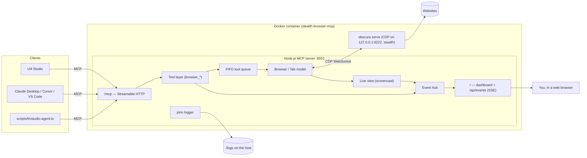

# Architecture

Stealth Browser MCP is one Docker container with two processes:

- **Node.js MCP server** (this repository): speaks the Model Context Protocol to AI clients, serves the live dashboard, and writes the logs.
- **Obscura** ([h4ckf0r0day/obscura](https://github.com/h4ckf0r0day/obscura)): a headless browser written in Rust that runs page JavaScript in V8 and renders pages. It runs in stealth mode and is controlled over the Chrome DevTools Protocol (CDP).

## Request flow

1. A client connects to `POST /mcp`. Current clients (including LM Studio 0.4.x) use the 2025 Streamable HTTP protocol: the server creates an MCP session (`Mcp-Session-Id`), one `McpServer` instance per session. Clients that speak the 2026-07-28 revision are routed to a stateless handler with the same tools.
2. A `tools/call` reaches `runTool()` (`src/mcp/server.ts`). It logs the call, publishes a "running" entry to the dashboard, and waits for the **browser queue**. All clients share one browser, and tool calls run one at a time in arrival order, so an agent always sees the effects of its previous action.
3. The tool handler (`src/tools/*.ts`) uses the `Tab` API (`src/browser/tab.ts`), which sends CDP commands through `CdpConnection` (`src/cdp/client.ts`). Page logic runs as small functions via `Runtime.callFunctionOn`, with the agent's input passed as JSON arguments rather than pasted into code.
4. The result goes back to the client and is logged. The dashboard entry is updated, and if someone is watching, a fresh frame of the page is pushed.

## Why the MCP server drives Obscura over CDP

Obscura ships its own `obscura mcp` command, but that runs the browser inside the MCP process, so nothing else can see the page. Obscura's CDP server is also **isolated per WebSocket connection**: a second connection cannot see or screenshot pages opened by the first. A separate "viewer" process therefore cannot watch the agent.

This project owns the single CDP connection. The live view is a `Page.startScreencast` on the agent's own tab, which runs only while at least one dashboard viewer is connected. Every tool is implemented on top of that same connection. This also let us fix bugs in Obscura's MCP tools, such as storage restore and form-submit navigation.

## Element references

`browser_snapshot` lists interactive elements with refs such as `e7`. A ref maps to Obscura's internal node id, which is the same as the CDP `backendNodeId`, and is stored **on the server**. Nothing is written into the page (no marker attributes or globals), so anti-bot scripts cannot see it. A ref stays the same for the same element until the document navigates. If the element is removed, using its ref returns a clear "stale ref" error.

## Clicking and typing

- Clicks scroll the element into view, check that the element is actually at that point (not covered), and send real mouse events (`Input.dispatchMouseEvent`). If the element is hidden or covered, they fall back to a DOM `click()` and say so.
- Actions that can navigate (click, Enter, submit, evaluate) are wrapped in `trackNavigation()`, so the tool reports the new URL and title and resets refs.
- URLs are normalized and checked against `ALLOWED_URL_SCHEMES`. `file:` and `javascript:` can never be enabled.

## Obscura quirks the code works around

| Quirk (Obscura v0.2.2) | Handling |
|---|---|
| Any CDP frame containing `"Browser.close"` closes the connection; `Fetch.*` text is dropped during navigation | Outgoing frames escape those substrings (`sanitizeOutgoingFrame`) |
| Some commands never get a reply | Every CDP command has a timeout; every tool has an overall timeout |
| `Page.navigate` reports HTTP 404/500 as success | Status is read from `Network.responseReceived` and shown to the agent |
| Screencast stops after 2 unacknowledged frames | Frames are acknowledged immediately; a still screenshot is taken if no frame arrives after an action |
| Element wrappers are not identity-stable | Scripts compare nodes by internal id |
| Commands on one connection are strictly serialized | Waits poll with short evaluations instead of one long promise |
| Browser state lives in the connection | If Obscura restarts, the server reconnects, and the next tool result tells the agent tabs were reset |

## Process supervision

`src/obscura/process.ts` starts `obscura serve --host 127.0.0.1` (CDP is never reachable from outside the container) and parses its log lines into structured logs. It restarts Obscura with exponential backoff if it crashes. Inside the container, `tini` is PID 1, Node is the supervisor, and Obscura is Node's child. `docker stop` shuts everything down cleanly within a second.

## Source map

| Path | Responsibility |
|---|---|
| `src/main.ts` | Startup, shutdown, wiring |
| `src/config.ts` | Environment variables → typed config |
| `src/logger.ts` | Logging to stdout, rotating file and dashboard tap |
| `src/obscura/process.ts` | Obscura lifecycle and its logs |
| `src/cdp/client.ts` | CDP WebSocket client |
| `src/browser/browser.ts` | Shared browser, tabs, queue, reconnects |
| `src/browser/tab.ts` | One page: JS helpers, refs, navigation, console and network capture |
| `src/browser/scripts.ts` | Page-side JavaScript |
| `src/browser/liveview.ts` | Screencast to the dashboard |
| `src/mcp/http.ts` | Express app, MCP transports, auth, host checks |
| `src/mcp/server.ts` | Tool registration and the `runTool` wrapper |
| `src/mcp/sessions.ts` | MCP session registry and idle reaper |
| `src/tools/*.ts` | The `browser_*` tools |
| `src/dashboard/` | Event hub, API routes, static UI |
| `src/stdio-bridge.ts` | stdio ↔ HTTP bridge for stdio-only MCP clients |
