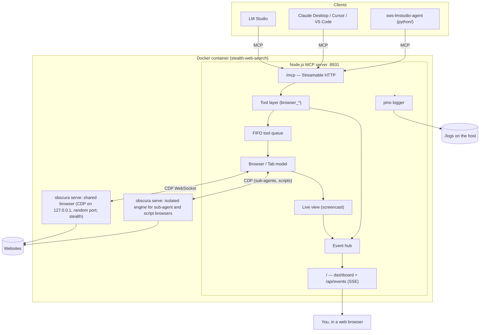
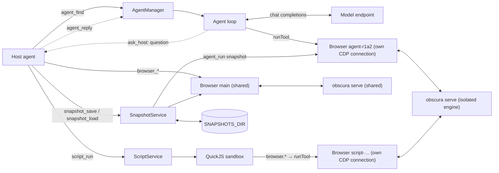

# Architecture

Stealth Web Search is one Docker container with three processes (two with `OBSCURA_SEPARATE_ENGINE=false`):

- **Node.js MCP server** (this repository): speaks the Model Context Protocol to AI clients, serves the live dashboard, and writes the logs.
- **Obscura** ([h4ckf0r0day/obscura](https://github.com/h4ckf0r0day/obscura)), twice: a headless browser written in Rust that runs page JavaScript in V8 and renders pages. It runs in stealth mode and is controlled over the Chrome DevTools Protocol (CDP). One engine holds the shared browser that MCP clients drive. The other, the isolated engine, holds the private browsers of sub-agents and script runs, so a page that crashes it cannot reset the shared browser; it never persists cookies. A sign-in reaches a sub-agent's browser only through a [snapshot](SNAPSHOTS.md) the host names for that run.

## Request flow

1. A client connects to `POST /mcp`. Current clients (including LM Studio 0.4.x) use the 2025 Streamable HTTP protocol: the server creates an MCP session (`Mcp-Session-Id`), one `McpServer` instance per session. Clients that speak the 2026-07-28 revision are routed to a stateless handler with the same tools.
2. A `tools/call` reaches `runTool()` (`src/mcp/server.ts`). It logs the call, publishes a "running" entry to the dashboard, and waits for the **browser queue**. All clients share one browser, and tool calls run one at a time in arrival order, so an agent always sees the effects of its previous action.
3. The tool handler (`src/tools/*.ts`) uses the `Tab` API (`src/browser/tab.ts`), which sends CDP commands through `CdpConnection` (`src/cdp/client.ts`). Page logic runs as small functions via `Runtime.callFunctionOn`, with the agent's input passed as JSON arguments rather than pasted into code.
4. The result goes back to the client and is logged. The dashboard entry is updated, and if someone is watching, a fresh frame of the page is pushed.

## Sub-agents and isolated browsers

`agent_run`, `agent_automate` and `agent_find` start a run in `AgentManager` (`src/agents/manager.ts`) and wait for it (bounded, with MCP progress notifications). Each run:

1. Gets its **own `Browser`**: an independent CDP connection of its own. Obscura isolates pages, cookies and storage per connection, so the run cannot see or disturb the host's shared browser or other runs. Sub-agent and script browsers connect to a second, managed Obscura process (`OBSCURA_SEPARATE_ENGINE`, on by default): an engine crash caused by a page they visit does not reset the host's browser, and that engine never persists cookies, so `OBSCURA_STORAGE_DIR` logins stay with the host. It has its own tool queue and live view. The `BrowserRegistry` lists it for the dashboard, and events it publishes (frames, console, network, tabs, pointer markers) carry its `browserId`, so a viewer only receives events of the browser it watches. If the host passed `snapshot` to `agent_run`, the `SnapshotService` loads it into this browser before the loop starts, and installs a reconnect hook that loads it again if the engine restarts during the run.
2. Runs the agent loop (`src/agents/run.ts`): ask the model (`src/agents/llm.ts`, OpenAI chat completions with function tools, streamed) for the next step, execute its tool calls through the same `runTool()` as MCP clients (logging, activity feed, redaction, timeouts, URL guards), feed the results back, repeat. The loop keeps the transcript within `AGENT_CONTEXT_TOKENS` (`src/agents/conversation.ts`), nudges a model that answers without calling a tool, and forces a final `finish` when steps or time run out. Secret answers from the host are masked by value in everything the loop logs or records (`AgentRun.scrub`, `src/util/scrub.ts`).
3. Uses the tools and prompt of its kind (`src/agents/kinds.ts`): the agentic kind has browser tools plus `web_search`/`note`/`ask_host`/`save_sign_in`/`finish`, and a purchase guard: `runTool()` passes it to the tools as `ToolContext.purchaseGuard`, and the click, form, typing and key tools call it with the label of the control they would activate (`guardPurchase()` in `src/tools/interaction.ts`), so a final order or payment button is refused until the host answered a `confirm` question (`looksLikeFinalPurchase()` and `purchaseGuardFor()` in `src/agents/run.ts`); the automation kind has `ask_host`, `script_save`/`script_test` and the same purchase guard (not applied to the scripts it tests); the finder kind has `web_search` (`src/agents/search.ts`) and `cite_source`, which checks that a cited page was opened and that the quote is on it.
4. Can pause on a question. `ask_host` is a concurrent tool, so it never holds the browser queue: it records the question with the URL of the browser's active tab, sets the run to `waiting`, releases the run's slot and waits. `AgentManager.reply()` (the host's `agent_reply`), the `AGENT_REPLY_TIMEOUT_MS` timer or a cancel closes the question and sets the run back to `running` before the waiting call resumes, so a result read right after a reply never shows the old question. The run then takes a slot back ahead of queued runs, and `run.deadline`, the only deadline the loop reads, moves by the time it waited. `AgentManager.wait()` returns as soon as a run waits, which is how `agent_run`, `agent_wait` and `agent_reply` hand the question to the host at once.
5. Ends by saving its sign-in back into its snapshot (only after a successful run, only if nobody saved a newer version meanwhile, and only if the browser still has the saved sign-in cookies), closing its browser, writing a transcript to `logs/agent-runs/`, and returning a text plus `structuredContent` result (`src/agents/format.ts`).

Agent and script tools are marked `concurrent`: they never wait in the host browser's queue, so the host keeps browsing while sub-agents work.

Paused runs keep their browser open, so the `--max-connections` budget the server gives Obscura counts them: the main browser, two connections per concurrent run (its browser and a script test), up to 10 waiting runs (`MAX_WAITING`), 4 script runs and a few spare (`src/util/limits.ts`, `src/obscura/process.ts`).

**Automation scripts** (`src/scripts/`) are stored as `<name>.js` + `<name>.json` in `SCRIPTS_DIR`. `script_run` and the automation agent's tests run them in a fresh isolated browser, inside a QuickJS WebAssembly sandbox (`sandbox.ts`) with no Node.js APIs. The script's only outlet is the `browser` object (`api.ts`), whose methods call the regular browser tools.

## Snapshots

Snapshots ([SNAPSHOTS.md](SNAPSHOTS.md)) are saved sign-ins that move between browsers only when an agent asks.

- `SnapshotStore` (`src/snapshots/store.ts`) keeps `<name>.json` (metadata, no secrets) and `<name>.state` (cookies and site storage, AES-256-GCM with `SNAPSHOTS_KEY`) in `SNAPSHOTS_DIR`. It writes the state first, through temporary files that are renamed, and serializes writes per name. An update re-reads the metadata under that lock and never creates a snapshot, so a deleted one stays deleted.
- `SnapshotService` (`src/snapshots/service.ts`) captures a browser's cookies for a domain filter plus the open page's storage, and applies a snapshot to a browser. The cookie and storage helpers are shared with the `state` tools (`src/browser/storage-state.ts`); snapshot code always sends them quietly, so no value reaches the CDP log.
- Obscura v0.2.2 loses `localStorage` on every navigation, so a loaded snapshot's storage is written by one `Page.addScriptToEvaluateOnNewDocument` script per browser (the storage seed), which runs on every new document of the saved origins. Script identifiers restart on every CDP connection, so an old one is removed only on the connection that issued it.
- Each `Browser` records which snapshots it has loaded, at which version and on which connection. A lost connection clears them: the main browser's next tool result says the snapshot was lost, and a sub-agent's browser gets it back through its reconnect hook (which deleting the snapshot removes). Loading or saving a snapshot unloads the others whose domain filters overlap (`filtersOverlap()`), and `browser_clear_cookies` unloads them all, so one browser never holds two accounts' markers or storage seeds for a site. A save that finds another version than the one this browser loaded is refused, and so is a refresh from a browser that lost the saved sign-in cookies.
- Every change to the store or to a browser's loaded snapshots publishes a `snapshots` event on the hub, which the dashboard's Snapshots tab renders. `DELETE /api/snapshots/:name` is the dashboard's only mutating route. It sits behind the Host and `AUTH_TOKEN` checks, and requires an `X-SBM-Request: 1` header and the server's own `Origin` (the custom header forces a CORS preflight that the server never approves).

## Why the MCP server drives Obscura over CDP

Obscura ships its own `obscura mcp` command, but that runs the browser inside the MCP process, so nothing else can see the page. Obscura's CDP server is also **isolated per WebSocket connection**: a second connection cannot see or screenshot pages opened by the first. A separate "viewer" process therefore cannot watch the agent.

This project owns the CDP connections: one for the shared browser and one per sub-agent or script run. The live view is a `Page.startScreencast` on the watched browser's own active tab, which runs only while at least one dashboard viewer watches that browser. Every tool is implemented on top of that same connection. This also let us fix bugs in Obscura's MCP tools, such as storage restore and form-submit navigation.

## Element references

`browser_snapshot` lists interactive elements with refs such as `e7`. A ref maps to Obscura's internal node id, which is the same as the CDP `backendNodeId`, and is stored **on the server**. Nothing is written into the page (no marker attributes or globals), so anti-bot scripts cannot see it. A ref stays the same for the same element until the document navigates. If the element is removed, using its ref returns a clear "stale ref" error.

## Clicking and typing

- Clicks scroll the element into view, check that the element is actually at that point (not covered), and send real mouse events (`Input.dispatchMouseEvent`). If the element is hidden or covered, they fall back to a DOM `click()` and say so.
- Actions that can navigate (click, Enter, submit, evaluate) are wrapped in `trackNavigation()`, so the tool reports the new URL and title and resets refs.
- URLs are normalized and checked against `ALLOWED_URL_SCHEMES`. `file:` and `javascript:` can never be enabled.

## Obscura quirks the code works around

| Quirk (Obscura v0.2.2) | Handling |
|---|---|
| Any CDP frame containing `"Browser.close"` closes the connection; `Fetch.*` text is dropped during navigation | Outgoing frames escape those substrings (`sanitizeOutgoingFrame`) |
| Some commands never get a reply | Every CDP command has a timeout; every tool has an overall timeout |
| `Page.navigate` reports HTTP 404/500 as success | Status is read from `Network.responseReceived` and shown to the agent |
| Screencast stops after 2 unacknowledged frames | Frames are acknowledged immediately; a still screenshot is taken if no frame arrives after an action |
| Element wrappers are not identity-stable | Scripts compare nodes by internal id |
| Commands on one connection are strictly serialized | Waits poll with short evaluations instead of one long promise |
| Browser state lives in the connection | If Obscura restarts, the server reconnects, and the next tool result tells the agent tabs were reset |

## Process supervision

`src/obscura/process.ts` starts `obscura serve --host 127.0.0.1` (CDP is never reachable from outside the container) and parses its log lines into structured logs. The server runs two of them, the shared engine and the isolated engine (one with `OBSCURA_SEPARATE_ENGINE=false` and no `OBSCURA_STORAGE_DIR`), and restarts each with exponential backoff if it crashes. Inside the container, `tini` is PID 1, Node is the supervisor, and the Obscura engines are Node's children. `docker stop` shuts everything down cleanly within a second.

## Python tools

The server is TypeScript. The developer tools that only talk to it from outside, over HTTP, are Python, in the [`python/`](../python/README.md) package (`stealth-web-search-tools`, Python 3.10+, dependencies pinned in `python/uv.lock`):

- `sws-lmstudio-agent` (`npm run lmstudio:agent`): the LM Studio command-line agent. It is an MCP client of the server (the MCP Python SDK, with the 2025-11-25 session handshake that LM Studio also uses) and a streaming client of LM Studio's OpenAI-compatible API, and it runs the model's tool calls on the server. It learns each tool's group from the tool list (`_meta`), so it needs nothing from `src/`.
- `sws-lmstudio-e2e` (`npm run lmstudio:e2e`) runs that agent through the end-to-end scenarios, and `sws-agents-e2e` (`npm run agents:e2e`) checks the sub-agents live.
- `sws-site` (`npm run site:build`, `npm run site:serve`) builds the website: Markdown with markdown-it-py, code highlighting with Pygments mapped onto the highlight.js class names that `site/assets/site.css` styles, and a link and anchor checker. It takes the tool counts from `docs/tools.json`, which `scripts/generate-tool-docs.ts` writes from the TypeScript tool registry next to `docs/TOOLS.md`.
- `scripts/setup_lmstudio.py` (`npm run lmstudio:setup`) and `scripts/download_obscura.py` (`npm run obscura:download`) are single files that use only the standard library and run on Python 3.9, so they need no setup.

The npm scripts run them through `scripts/py.mjs`: with `uv run --project python` when uv is installed, else from `python/.venv` (`npm run py:setup`), else with a Python that already has the package. It passes arguments, exit codes and signals through. The Python tests (`python/tests/`, `npm run test:py`) start the real TypeScript server the way `test/helpers/harness.ts` does, with scripted stand-ins for LM Studio and the sub-agents' model.

## Why the server stays in TypeScript

A Python port of the server was measured before this split (Apple M4 Max, Node 24, Python 3.13, the official MCP SDKs of both languages), and it would be slower where it matters:

| Measure | TypeScript | Python |
|---|---|---|
| `tools/call` round trip, minimal server on the official SDK (p50) | 0.085 ms | 0.34-0.52 ms |
| Calls per second, 4 sessions, minimal server | about 24,000 | about 3,000 (5,600 with JSON responses) |
| The real server, `browser_tab_list` with a CDP round trip (p50) | 0.28 ms | (a minimal Python server is already slower) |
| Start to ready, minimal server | 87 ms | 290 ms |
| stdio bridge, start to first answer | 68-104 ms | about 290 ms |

The cost is in the Python SDK (task groups and memory streams per request, and about 100 ms of pydantic model building at import), not in the language: a hand-written Python endpoint without the SDK answered in 0.06 ms. Python did better in the data-heavy parts, with orjson: parsing and encoding screencast frames, dashboard SSE fan-out, and memory (75-85 MB against 158 MB idle). But those parts live in the same process as the MCP server and share its browser objects, so moving them would add a hop per frame and per CDP command and a second runtime in the image. The measurements instead pointed at TypeScript fixes, which this version has: the stdio bridge's keep-alive delay on Node 24.17-24.20 (`src/util/keepalive-fetch.ts`, relay p50 about 1.8 ms to 0.3 ms), frames encoded once for all dashboard viewers, a cheaper log tap, and tool-call timers that no longer keep every call in memory.

The Python tools are separate processes that only call the server. Their cost is their start-up, mostly importing the MCP SDK: the command-line agent starts about 150 ms later than the TypeScript version on a current Node (24.21 or newer) and adds about 0.3-0.7 ms per step, next to model answers that take seconds; on Node 24.17-24.20 its steps are faster than the TypeScript version's were.

## Source map

| Path | Responsibility |
|---|---|
| `src/main.ts` | Startup, shutdown, wiring |
| `src/config.ts` | Environment variables → typed config |
| `src/models-config.ts` | `config/models.json`: parsing (comments, duplicate keys), validation, model choice |
| `src/check-config.ts` | `npm run config:check`: prints the settings the server will use, `--ping` checks the model endpoint |
| `src/logger.ts` | Logging to stdout, rotating file and dashboard tap |
| `src/obscura/process.ts` | Obscura lifecycle and its logs |
| `src/cdp/client.ts` | CDP WebSocket client |
| `src/browser/browser.ts` | A browser (the shared one or a sub-agent's): tabs, queue, reconnects |
| `src/browser/tab.ts` | One page: JS helpers, refs, navigation, console and network capture |
| `src/browser/scripts.ts` | Page-side JavaScript |
| `src/browser/liveview.ts` | Screencast to the dashboard |
| `src/mcp/http.ts` | Express app, MCP transports, auth, host checks |
| `src/mcp/server.ts` | Tool registration and the `runTool` wrapper |
| `src/mcp/sessions.ts` | MCP session registry and idle reaper |
| `src/tools/*.ts` | The `browser_*`, `agent_*`, `script_*` and `snapshot_*` tools |
| `src/browser/registry.ts` | All browsers (main, sub-agents, script runs) for the dashboard |
| `src/browser/storage-state.ts` | Reading and writing cookies and site storage, shared by the `state` tools and snapshots |
| `src/agents/` | Sub-agents: model client, agent loop (with questions to the host), context compaction, the three kinds, web search, result formatting |
| `src/scripts/` | Automation scripts: file store, QuickJS sandbox, the scripts' `browser` API, running them |
| `src/snapshots/` | Snapshots: the file store (with encryption) and the service that captures, applies and tracks them |
| `src/util/` | Shared helpers: log summaries, masking of secret answers, limits shared by the agent manager, script runs and the Obscura connection budget |
| `src/dashboard/` | Event hub, API routes, static UI |
| `src/stdio-bridge.ts` | stdio ↔ HTTP bridge for stdio-only MCP clients |
| `src/util/keepalive-fetch.ts` | The bridge's keep-alive fix for the undici bundled with Node 24.17-24.20 |
| `scripts/generate-tool-docs.ts` | `npm run docs:tools`: `docs/TOOLS.md` and `docs/tools.json` from the tool registry |
| `scripts/py.mjs` | Runs the Python tools for the npm scripts (uv, `python/.venv` or a system Python) |
| `scripts/setup_lmstudio.py`, `scripts/download_obscura.py` | `npm run lmstudio:setup` and `npm run obscura:download` (standard library, Python 3.9+) |
| `python/src/sws_tools/lmstudio_agent/` | The LM Studio command-line agent (`npm run lmstudio:agent`) |
| `python/src/sws_tools/lmstudio_e2e/`, `python/src/sws_tools/agents_e2e/` | The live end-to-end runners (`npm run lmstudio:e2e`, `npm run agents:e2e`) |
| `python/src/sws_tools/website/` | The website builder (`npm run site:build`, `npm run site:serve`) |
